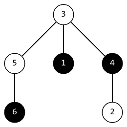
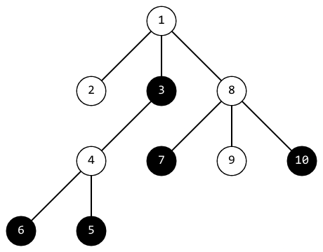

<h1 style='text-align: center;'> F. Timofey and Black-White Tree</h1>

<h5 style='text-align: center;'>time limit per test: 4 seconds</h5>
<h5 style='text-align: center;'>memory limit per test: 256 megabytes</h5>

Timofey came to a famous summer school and found a tree on $n$ vertices. A tree is a connected undirected graph without cycles.

Every vertex of this tree, except $c_0$, is colored white. The vertex $c_0$ is colored black.

Timofey wants to color all the vertices of this tree in black. To do this, he performs $n - 1$ operations. During the $i$-th operation, he selects the vertex $c_i$, which is currently white, and paints it black.

Let's call the positivity of tree the minimum distance between all pairs of different black vertices in it. The distance between the vertices $v$ and $u$ is the number of edges on the path from $v$ to $u$.

After each operation, Timofey wants to know the positivity of the current tree.

## Input

The first line contains the integer $t$ ($1 \le t \le 10^4$) — the number of testcases.

The first line of each testcase contains the integers $n, c_0$ ($2 \le n \le 2 \cdot 10^5$, $1 \le c_0 \le n$) — the number of vertices in the tree and index of the initial black vertex.

The second line of each testcase contains $n - 1$ unique integers $c_1, c_2, \dots, c_{n-1}$ ($1 \le c_i \le n$, $c_i \ne c_0$), where $c_i$ is the vertex which is colored black during the $i$-th operation.

Each of the next $n - 1$ row of each testcase contains the integers $v_i, u_i$ ($1 \le v_i, u_i \le n$) — edges in the tree.

It is guaranteed that the sum of $n$ for all testcases does not exceed $2 \cdot 10^5$.

## Output

For each testcase, print $n - 1$ integer on a separate line.

The integer with index $i$ must be equal to positivity of the tree obtained by the first $i$ operations.

## Example

## Input


```

66 64 1 3 5 22 46 55 33 41 34 24 1 33 12 31 410 310 7 6 5 2 9 8 1 41 21 34 54 36 48 79 810 81 87 37 5 1 2 4 61 23 24 53 46 57 69 79 3 1 4 2 6 8 54 18 94 82 67 32 43 55 410 21 8 5 10 6 9 4 3 710 77 83 69 77 64 21 67 59 2
```
## Output


```

3 2 1 1 1 
3 1 1 
3 2 2 2 2 2 1 1 1 
4 2 2 1 1 1 
5 1 1 1 1 1 1 1 
4 3 2 2 1 1 1 1 1 

```
## Note

In the first testcase, after the second operation, the tree looks like this: 

The distance between vertices $1$ and $6$ is $3$, the distance between vertices $4$ and $6$ is $3$, the distance between vertices $1$ and $4$ is $2$. The positivity of this tree is equal to the minimum of these distances. It equals $2$.

In the third testcase, after the fourth operation, the tree looks like this: 

The positivity of this tree is $2$.


#### tags 

#2100 #brute_force #dfs_and_similar #divide_and_conquer #graphs #greedy #math #shortest_paths #trees 