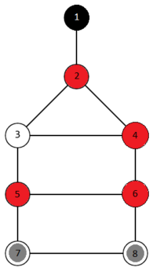

<h1 style='text-align: center;'> G. Tokens on Graph</h1>

<h5 style='text-align: center;'>time limit per test: 2 seconds</h5>
<h5 style='text-align: center;'>memory limit per test: 256 megabytes</h5>

You are given an undirected connected graph, some vertices of which contain tokens and/or bonuses. Consider a game involving one player  — you.

You can move tokens according to the following rules:

* At the beginning of the game, you can make exactly one turn: move any token to any adjacent vertex.
* If the movement of the token ended on the bonus, then you are allowed to make another turn with any other token.

You can use different bonuses in any order. The same bonus can be used an unlimited number of times. Bonuses do not move during the game.

There can be several tokens in one vertex at the same time, but initially there is no more than one token in each vertex.

The vertex with number $1$ is the finish vertex, and your task is to determine whether it is possible to hit it with any token by making turns with the tiles according to the rules described above. If a token is initially located at the vertex of $1$, then the game is considered already won.

  The finish line is in black, the bonuses are in red, the chips are in grey.  For example, for a given graph, you can reach the finish line with a chip from the $8$th vertex by making the following sequence of turns: 1. Move from the $8$-th vertex to the $6$-th.
2. Move from the $7$-th vertex to the $5$-th.
3. Move from the $6$-th vertex to the $4$-th.
4. Move from the $5$-th vertex to the $6$-th.
5. Move from the $4$-th vertex to the $2$-nd.
6. Move from the $6$-th vertex to the $4$-th.
7. Move from the $2$-nd vertex to the $1$-st vertex, which is the finish.
## Input

The first line of input data contains a single integer $t$ ($1 \le t \le 10^4$) — number of test cases in the test. The descriptions of the test cases follow.

The first line of the description of each test case contains two integers $n$ and $m$ ($1 \le n \le 2 \cdot 10^5$, $0 \le m \le 2 \cdot 10^5$) — the number of vertices and edges in the graph, respectively.

The second line of the description of each test case contains two integers $p$ and $b$ ($1 \le p \le n, 0 \le b \le n$) — the number of tokens and bonuses, respectively.

The third line of the description of each test case contains $p$ different integers from $1$ to $n$ — the indices of the vertices in which the tokens are located.

The fourth line of the description of each input data set contains $b$ different integers from $1$ to $n$ — the indices of the vertices in which the bonuses are located. ## Note

 that the value of $b$ can be equal to $0$. In this case, this line is empty.

There can be both a token and a bonus in one vertex at the same time.

The next $m$ lines of the description of each test case contain two integers $u_i$ and $v_i$ ($1 \le u_i, v_i \le n$, $u_i \ne v_i$) — vertices connected by the $i$-th edge. There is at most one edge between each pair of vertices. The given graph is connected, that is, from any vertex you can get to any one by moving along the edges.

The test cases are separated by an empty string.

It is guaranteed that the sum of $n$ over all test cases does not exceed $2 \cdot 10^5$. Similarly, it is guaranteed that the sum of $m$ over all input data sets does not exceed $2 \cdot 10^5$.

## Output

For each test case, print YES in a separate line if you can reach the finish with some token, and NO otherwise.

You can output YES and NO in any case (for example, the strings yEs, yes, Yes and YES will be recognized as a positive response).

## Example

## Input


```

68 102 47 82 4 5 61 22 32 43 43 54 65 65 76 87 8  
5 41 1531 22 33 44 5  
2 11 02  
1 2  
4 31 223 41 22 32 4  
5 43 25 3 42 41 22 33 44 5  
1 01 111
```
## Output


```

YES
NO
YES
YES
YES
YES

```
## Note

* The first test case is explained in the statement.
* In the second test case, there is only one token which can make only one turn, and it cannot reach the finish.
* In the third test case, the token can reach the finish line in $1$ turn.
* In the fourth test case, you need to make just one turn from $2$ to $1$.
* In the sixth test case, the token is initially at node number $1$, so we win immediately.


#### tags 

#2300 #constructive_algorithms #dfs_and_similar #graphs #shortest_paths 