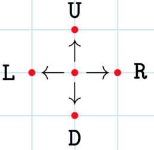
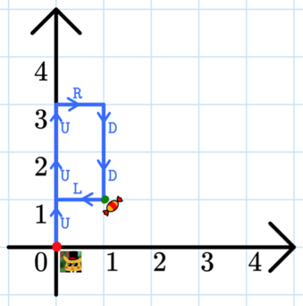

<h1 style='text-align: center;'> B. Following Directions</h1>

<h5 style='text-align: center;'>time limit per test: 1 second</h5>
<h5 style='text-align: center;'>memory limit per test: 256 megabytes</h5>

Alperen is standing at the point $(0,0)$. He is given a string $s$ of length $n$ and performs $n$ moves. The $i$-th move is as follows: 

* if $s_i = \texttt{L}$, then move one unit left;
* if $s_i = \texttt{R}$, then move one unit right;
* if $s_i = \texttt{U}$, then move one unit up;
* if $s_i = \texttt{D}$, then move one unit down.

   If Alperen starts at the center point, he can make the four moves shown.  There is a candy at $(1,1)$ (that is, one unit above and one unit to the right of Alperen's starting point). You need to determine if Alperen ever passes the candy.   Alperen's path in the first test case. ## Input

The first line of the input contains an integer $t$ ($1 \leq t \leq 1000$) — the number of testcases.

The first line of each test case contains an integer $n$ ($1 \leq n \leq 50$) — the length of the string.

The second line of each test case contains a string $s$ of length $n$ consisting of characters $\texttt{L}$, $\texttt{R}$, $\texttt{D}$, and $\texttt{U}$, denoting the moves Alperen makes.

## Output

For each test case, output "YES" (without quotes) if Alperen passes the candy, and "NO" (without quotes) otherwise.

You can output the answer in any case (for example, the strings "yEs", "yes", "Yes" and "YES" will be recognized as a positive answer).

## Example

## Input


```

77UUURDDL2UR8RRRUUDDD3LLL4DUUR5RUDLL11LLLLDDRUDRD
```
## Output


```

YES
YES
NO
NO
YES
YES
NO

```
## Note

In the first test case, Alperen follows the path $$(0,0) \overset{\texttt{U}}{\to} (0,1) \overset{\texttt{U}}{\to} (0,2) \overset{\texttt{U}}{\to} (0,3) \overset{\texttt{R}}{\to} (1,3) \overset{\texttt{D}}{\to} (1,2) \overset{\texttt{D}}{\to} \color{green}{\mathbf{(1,1)}} \overset{\texttt{L}}{\to} (0,1).$$ ## Note

 that Alperen doesn't need to end at the candy's location of $(1,1)$, he just needs to pass it at some point.

In the second test case, Alperen follows the path $$(0,0) \overset{\texttt{U}}{\to} (0,1) \overset{\texttt{R}}{\to} \color{green}{\mathbf{(1,1)}}.$$

In the third test case, Alperen follows the path $$(0,0) \overset{\texttt{R}}{\to} (1,0) \overset{\texttt{R}}{\to} (2,0) \overset{\texttt{R}}{\to} (3,0) \overset{\texttt{U}}{\to} (3,1) \overset{\texttt{U}}{\to} (3,2) \overset{\texttt{D}}{\to} (3,1) \overset{\texttt{D}}{\to} (3,0) \overset{\texttt{D}}{\to} (3,-1).$$

In the fourth test case, Alperen follows the path $$(0,0) \overset{\texttt{L}}{\to} (-1,0) \overset{\texttt{L}}{\to} (-2,0) \overset{\texttt{L}}{\to} (-3,0).$$


#### tags 

#800 #geometry #implementation 