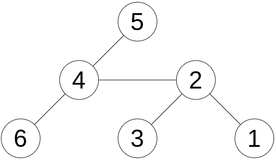
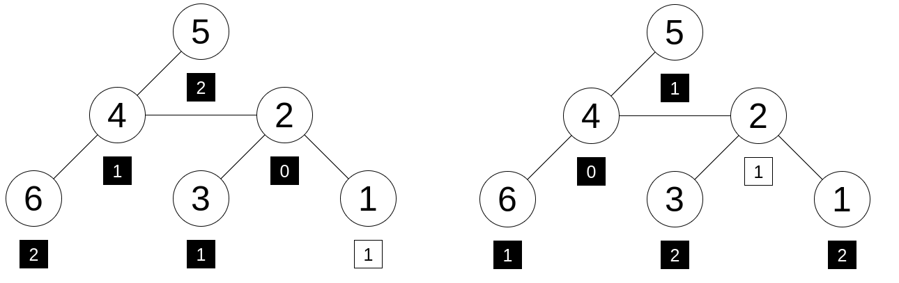

<h1 style='text-align: center;'> E. Labeling the Tree with Distances</h1>

<h5 style='text-align: center;'>time limit per test: 4 seconds</h5>
<h5 style='text-align: center;'>memory limit per test: 256 megabytes</h5>

You are given an unweighted tree of $n$ vertices numbered from $1$ to $n$ and a list of $n-1$ integers $a_1, a_2, \ldots, a_{n-1}$. A tree is a connected undirected graph without cycles. You will use each element of the list to label one vertex. No vertex should be labeled twice. You can label the only remaining unlabeled vertex with any integer. 

A vertex $x$ is called good if it is possible to do this labeling so that for each vertex $i$, its label is the distance between $x$ and $i$. The distance between two vertices $s$ and $t$ on a tree is the minimum number of edges on a path that starts at vertex $s$ and ends at vertex $t$. 

Find all good vertices.

## Input

The first line contains one integer $n$ ($2\le n\le 2\cdot 10^5$) — the number of vertices in the tree.

The second line contains $n - 1$ integers $a_1,a_2,\ldots,a_{n-1}$ ($0\le a_i < n$) — the given list.

Then, $n−1$ lines follow. Each of them contains two integers $u$ and $v$ ($1\le u,v\le n$) denoting an edge between vertices $u$ and $v$. It is guaranteed that the edges form a tree.

## Output

In the first line print the number of good vertices.

In the second line, print the indices of all good vertices in ascending order.

## Examples

## Input


```

6
2 1 0 1 2
1 2
2 3
2 4
4 5
4 6

```
## Output


```

2
2 4 

```
## Input


```

5
1 2 1 2
1 2
3 2
3 4
5 4

```
## Output


```

1
3 

```
## Input


```

3
2 2
1 2
2 3

```
## Output


```

0

```
## Note

This is the tree for the first example: 

  And these are two possible labelings with the elements on the list so that $2$ is a good vertex (left) and $4$ is a good vertex (right).

  The square below each vertex represents its label. The black squares contain the numbers which were on the given list and the only white square contains the only number which was not on the given list.

In the second example, the only good vertex is vertex $3$.

In the third example, there are no good vertices.


#### tags 

#2400 #data_structures #dp #greedy #hashing #implementation #trees 