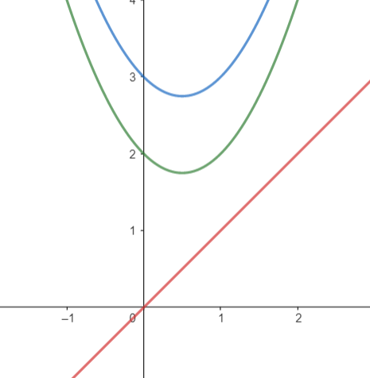
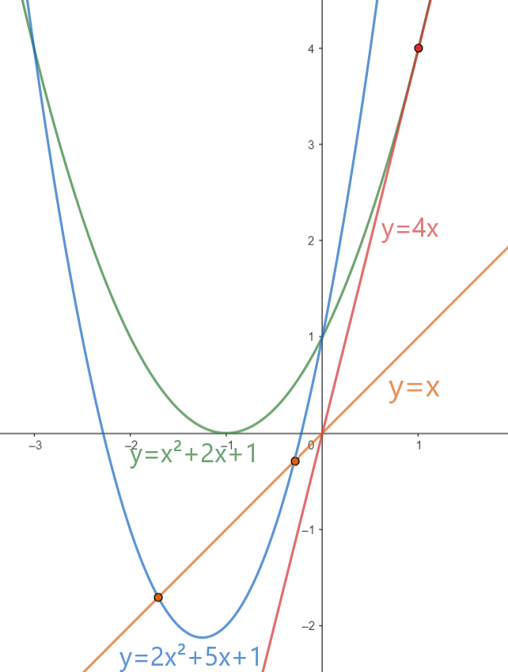

<h1 style='text-align: center;'> C. Place for a Selfie</h1>

<h5 style='text-align: center;'>time limit per test: 2 seconds</h5>
<h5 style='text-align: center;'>memory limit per test: 256 megabytes</h5>

The universe is a coordinate plane. There are $n$ space highways, each of which is a straight line $y=kx$ passing through the origin $(0, 0)$. Also, there are $m$ asteroid belts on the plane, which we represent as open upwards parabolas, i. e. graphs of functions $y=ax^2+bx+c$, where $a > 0$.

You want to photograph each parabola. To do this, for each parabola you need to choose a line that does not intersect this parabola and does not touch it. You can select the same line for different parabolas. Please find such a line for each parabola, or determine that there is no such line.

## Input

Each test contains multiple test cases. The first line contains the number of test cases $t$ ($1 \le t \le 10^4$). The description of the test cases follows.

The first line of each test case contains $2$ integers $n$ and $m$ ($1 \le n, m \le 10^5$) —the number of lines and parabolas, respectively.

Each of the next $n$ lines contains one integer $k$ ($|k| \le 10^8$), denoting a line that is described with the equation $y=kx$. The lines are not necessarily distinct, $k$ can be equal to $0$.

Each of the next $m$ lines contains $3$ integers $a$, $b$, and $c$ ($a, |b|, |c| \le 10^8$, $a > 0$) — coefficients of equations of the parabolas $ax^2+bx+c$. The parabolas are not necessarily distinct.

It is guaranteed that the sum $n$ over all test cases does not exceed $10^5$, and the sum $m$ over all test cases also does not exceed $10^5$.

## Output

For each test case, output the answers for each parabola in the given order. If there is a line that does not intersect the given parabola and doesn't touch it, print on a separate line the word "YES", and then on a separate line the number $k$ — the coefficient of this line. If there are several answers, print any of them. If the line does not exist, print one word "NO".

You can output the answer in any case (upper or lower). For example, the strings "yEs", "yes", "Yes", and "YES" will be recognized as positive responses.

The empty lines in the output in the example are given only for illustration, you do not need to output them (but you can).

## Example

## Input


```

51 211 -1 21 -1 32 2141 2 12 5 11 101 0 01 1100000000100000000 100000000 1000000002 3022 2 11 -2 11 -2 -1
```
## Output


```

YES
1
YES
1

YES
1
YES
4

NO

YES
100000000

YES
0
NO
NO

```
## Note

In the first test case, both parabolas do not intersect the only given line $y=1\cdot x$, so the answer is two numbers $1$.

  In the second test case, the line $y=x$ and the parabola $2x^2+5x+1$ intersect, and also the line $y=4x$ and the parabola $x^2+2x+1$ touch, so these pairs do not satisfy the condition. So for the first parabola, the answer is $1$ ($y=1x$), and for the second parabola — $4$.

  In the third test set, the line and the parabola intersect, so the answer is "NO".


#### tags 

#1400 #binary_search #data_structures #geometry #math 