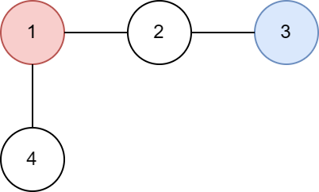
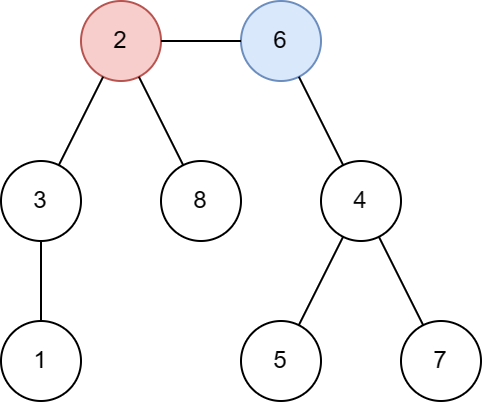

<h1 style='text-align: center;'> F. Random Walk</h1>

<h5 style='text-align: center;'>time limit per test: 2 seconds</h5>
<h5 style='text-align: center;'>memory limit per test: 256 megabytes</h5>

You are given a tree consisting of $n$ vertices and $n - 1$ edges, and each vertex $v$ has a counter $c(v)$ assigned to it.

Initially, there is a chip placed at vertex $s$ and all counters, except $c(s)$, are set to $0$; $c(s)$ is set to $1$.

Your goal is to place the chip at vertex $t$. You can achieve it by a series of moves. Suppose right now the chip is placed at the vertex $v$. In one move, you do the following:

1. choose one of neighbors $to$ of vertex $v$ uniformly at random ($to$ is neighbor of $v$ if and only if there is an edge $\{v, to\}$ in the tree);
2. move the chip to vertex $to$ and increase $c(to)$ by $1$;

You'll repeat the move above until you reach the vertex $t$.

For each vertex $v$ calculate the expected value of $c(v)$ modulo $998\,244\,353$.

## Input

The first line contains three integers $n$, $s$ and $t$ ($2 \le n \le 2 \cdot 10^5$; $1 \le s, t \le n$; $s \neq t$) — number of vertices in the tree and the starting and finishing vertices.

Next $n - 1$ lines contain edges of the tree: one edge per line. The $i$-th line contains two integers $u_i$ and $v_i$ ($1 \le u_i, v_i \le n$; $u_i \neq v_i$), denoting the edge between the nodes $u_i$ and $v_i$.

It's guaranteed that the given edges form a tree.

## Output

Print $n$ numbers: expected values of $c(v)$ modulo $998\,244\,353$ for each $v$ from $1$ to $n$.

Formally, let $M = 998\,244\,353$. It can be shown that the answer can be expressed as an irreducible fraction $\frac{p}{q}$, where $p$ and $q$ are integers and $q \not \equiv 0 \pmod{M}$. ## Output

 the integer equal to $p \cdot q^{-1} \bmod M$. In other words, output such an integer $x$ that $0 \le x < M$ and $x \cdot q \equiv p \pmod{M}$.

## Examples

## Input


```

3 1 3
1 2
2 3

```
## Output


```

2 2 1 

```
## Input


```

4 1 3
1 2
2 3
1 4

```
## Output


```

4 2 1 2 

```
## Input


```

8 2 6
6 4
6 2
5 4
3 1
2 3
7 4
8 2

```
## Output


```

1 3 2 0 0 1 0 1 

```
## Note

The tree from the first example is shown below: 

   Let's calculate expected value $E[c(1)]$: * $P(c(1) = 0) = 0$, since $c(1)$ is set to $1$ from the start.
* $P(c(1) = 1) = \frac{1}{2}$, since there is the only one series of moves that leads $c(1) = 1$. It's $1 \rightarrow 2 \rightarrow 3$ with probability $1 \cdot \frac{1}{2}$.
* $P(c(1) = 2) = \frac{1}{4}$: the only path is $1 \rightarrow_{1} 2 \rightarrow_{0.5} 1 \rightarrow_{1} 2 \rightarrow_{0.5} 3$.
* $P(c(1) = 3) = \frac{1}{8}$: the only path is $1 \rightarrow_{1} 2 \rightarrow_{0.5} 1 \rightarrow_{1} 2 \rightarrow_{0.5} 1 \rightarrow_{1} 2 \rightarrow_{0.5} 3$.
* $P(c(1) = i) = \frac{1}{2^i}$ in general case.

 As a result, $E[c(1)] = \sum\limits_{i=1}^{\infty}{i \frac{1}{2^i}} = 2$. Image of tree in second test   Image of tree in third test  

#### tags 

#2600 #dp #graphs #math #probabilities #trees 