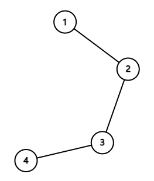

<h1 style='text-align: center;'> B1. LuoTianyi and the Floating Islands (Easy Version)</h1>

<h5 style='text-align: center;'>time limit per test: 2 seconds</h5>
<h5 style='text-align: center;'>memory limit per test: 256 megabytes</h5>

This is the easy version of the problem. The only difference is that in this version $k\le\min(n,3)$. You can make hacks only if both versions of the problem are solved.

  Chtholly and the floating islands. LuoTianyi now lives in a world with $n$ floating islands. The floating islands are connected by $n-1$ undirected air routes, and any two of them can reach each other by passing the routes. That means, the $n$ floating islands form a tree.

One day, LuoTianyi wants to meet her friends: Chtholly, Nephren, William, .... Totally, she wants to meet $k$ people. She doesn't know the exact positions of them, but she knows that they are in pairwise distinct islands. She define an island is good if and only if the sum of the distances$^{\dagger}$ from it to the islands with $k$ people is the minimal among all the $n$ islands.

Now, LuoTianyi wants to know that, if the $k$ people are randomly set in $k$ distinct of the $n$ islands, then what is the expect number of the good islands? You just need to tell her the expect number modulo $10^9+7$.

$^{\dagger}$The distance between two islands is the minimum number of air routes you need to take to get from one island to the other.

## Input

The first line contains two integers $n$ and $k$ ($1\le k \le \min(n,3), 1\le n \le 2\cdot 10^5$) — the number of the islands and people respectively.

Next $n−1$ lines describe the air routes. The $i$-th of them contains two integers $u_i$ and $v_i$ ($1 \le u_i,v_i \le n, u_i \neq v_i$) — the islands connected by the $i$-th air route.

## Output

Print a single integer — the expect number of the good islands modulo $10^9 + 7$.

Formally, let $M = 10^9 + 7$. It can be shown that the answer can be expressed as an irreducible fraction $\frac{p}{q}$, where $p$ and $q$ are integers and $q \not \equiv 0$ ($\operatorname{mod} M$). ## Output

 the integer equal to $p \cdot q^{-1}$ $\operatorname{mod} M$. In other words, output such an integer $x$ that $0 \le x < M$ and $x \cdot q \equiv p$ ($\operatorname{mod} M$).

## Examples

## Input


```

4 2
1 2
2 3
3 4

```
## Output


```

666666674

```
## Input


```

5 1
1 2
2 3
3 4
3 5

```
## Output


```

1

```
## Note

In the first example the air routes form the following tree:

   If the people are in the islands $1$ and $2$, then islands $1$ and $2$ will be good.

The sum of the distances from island $1$ or $2$ to all the people is $1+0=1$, which is the minimal. While the sum of the distances from island $3$ to all the people is $2+1=3$, which is greater than $1$.

Like this, when the people are in island $1$ and $3$, then islands $1,2$ and $3$ will be good.

When the people are in islands $1$ and $4$, then islands $1,2,3$ and $4$ will be good.

When the people are in islands $2$ and $3$, then islands $2$ and $3$ will be good.

When the people are in islands $2$ and $4$, then islands $2,3$ and $4$ will be good.

When the people are in islands $3$ and $4$, then islands $3$ and $4$ will be good.

So the expect of the number of the good islands is $\frac{16}{6}$, which equals to $666666674$ modulo $10^9+7$.

In the second example the air routes form the following tree:

  There is always the only good island, so the expected number is $1$.


#### tags 

#1800 #combinatorics #math #probabilities #trees 