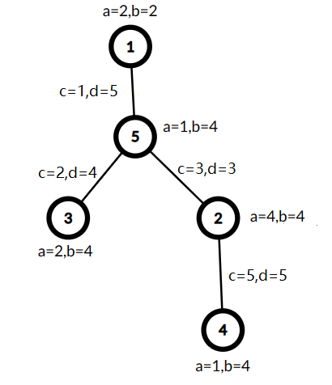

<h1 style='text-align: center;'> E. LuoTianyi and Cartridge</h1>

<h5 style='text-align: center;'>time limit per test: 3 seconds</h5>
<h5 style='text-align: center;'>memory limit per test: 1024 megabytes</h5>

LuoTianyi is watching the anime Made in Abyss. She finds that making a Cartridge is interesting. To describe the process of making a Cartridge more clearly, she abstracts the original problem and gives you the following problem.

You are given a tree $T$ consisting of $n$ vertices. Each vertex has values $a_i$ and $b_i$ and each edge has values $c_j$ and $d_j$.

Now you are aim to build a tree $T'$ as follows:

* First, select $p$ vertices from $T$ ($p$ is a number chosen by yourself) as the vertex set $S'$ of $T'$.
* Next, select $p-1$ edges from $T$ one by one (you cannot select one edge more than once).
* May you have chosen the $j$-th edge connects vertices $x_j$ and $y_j$ with values $(c_j,d_j)$, then you can choose two vertices $u$ and $v$ in $S'$ that satisfy the edge $(x_j,y_j)$ is contained in the simple path from $u$ to $v$ in $T$, and link $u$ and $v$ in $T'$ by the edge with values $(c_j,d_j)$ ($u$ and $v$ shouldn't be contained in one connected component before in $T'$).

  A tree with three vertices, $\min(A,C)=1,B+D=7$, the cost is $7$.   Selected vertices $2$ and $3$ as $S'$, used the edge $(1,2)$ with $c_j = 2$ and $d_j = 1$ to link this vertices, now $\min(A,C)=2,B+D=4$, the cost is $8$. Let $A$ be the minimum of values $a_i$ in $T'$ and $C$ be the minimum of values $c_i$ in $T'$. Let $B$ be the sum of $b_i$ in $T'$ and $D$ be the sum of values $d_i$ in $T'$. Let $\min(A, C) \cdot (B + D)$ be the cost of $T'$. You need to find the maximum possible cost of $T'$.

## Input

The first line contains one integer $n$ ($3\le n \le 2\cdot 10^5$) — the number of vertices in the tree $T$.

The second line contains $n$ integers $a_1, a_2, \ldots, a_n$ ($1\le a_i\le 2\cdot 10^5$), where the $i$-th integer represents the $a_i$ value of the $i$-th vertex.

The third line contains $n$ integers $b_1, b_2, \ldots, b_n$ ($1\le b_i\le 2\cdot 10^5$), where the $i$-th integer represents the $b_i$ value of the $i$-th vertex.

Then $n-1$ lines follow, the $j$-th of them contains four integers $x_j,y_j,c_j,d_j$ ($1\le x_j,y_j\le n,1\le c_j,d_j\le 2\cdot 10^5$) representing the edge $(x_j,y_j)$ and its values $c_j$ and $d_j$ respectively. It's guaranteed that edges form a tree.

## Output

Print a single integer — the maximum possible cost of $T'$.

## Examples

## Input


```

3
1 2 2
1 1 2
1 2 2 1
1 3 1 2

```
## Output


```

8
```
## Input


```

5
2 4 2 1 1
2 4 4 4 4
2 5 3 3
3 5 2 4
4 2 5 5
5 1 1 5

```
## Output


```

35
```
## Input


```

6
5 7 10 7 9 4
6 9 7 9 8 5
2 1 5 1
3 2 2 4
4 3 6 3
5 1 7 4
6 5 6 8

```
## Output


```

216
```
## Input


```

5
1000 1000 1 1000 1000
1000 1000 1 1000 1000
1 2 1 1
2 3 1000 1000
3 4 1000 1000
3 5 1000 1000

```
## Output


```

7000000
```
## Note

The tree from the first example is shown in the statement.

The tree from the second example is shown below:

  $A = 1, B = 18, C = 1, D = 17$, so the cost is $\min(1,1) \cdot (18 + 17) = 35$.


#### tags 

#3500 #data_structures #trees 