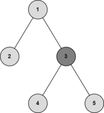
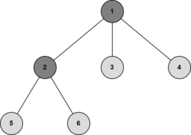
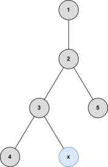
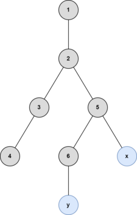
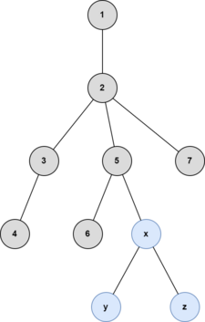

<h1 style='text-align: center;'> D. Two Centroids</h1>

<h5 style='text-align: center;'>time limit per test: 1.5 seconds</h5>
<h5 style='text-align: center;'>memory limit per test: 1024 megabytes</h5>

You are given a tree (an undirected connected acyclic graph) which initially only contains vertex $1$. There will be several queries to the given tree. In the $i$-th query, vertex $i + 1$ will appear and be connected to vertex $p_i$ ($1 \le p_i \le i$). 

After each query, please find out the least number of operations required to make the current tree has two centroids. In one operation, you can add one vertex and one edge to the tree such that it remains a tree.

A vertex is called a centroid if its removal splits the tree into subtrees with at most $\lfloor \frac{n}{2} \rfloor$ vertices each, with $n$ as the number of vertices of the tree. For example, the centroid of the following tree is $3$ because the biggest subtree after removing the centroid has $2$ vertices.

  In the next tree, vertex $1$ and $2$ are both centroids.

  ## Input

Each test contains multiple test cases. The first line contains the number of test cases $t$ ($1 \le t \le 10^4$). The description of the test cases follows.

The first line of each test case contains a single integer $n$ ($2 \le n \le 5 \cdot 10^{5}$) — the number of nodes of the final tree.

The second line of each test case contains $n - 1$ integers $p_1, p_2, \ldots, p_{n - 1}$ ($1 \le p_i \le i$) — the index of the vertex that is connected to vertex $i + 1$.

It is guaranteed that the sum of $n$ over all test cases does not exceed $5 \cdot 10^{5}$.

## Output

For each test case, output $n - 1$ integers. The $i$-th integer is the answer to the $i$-th query — the least number of operations required to make the current tree have two centroids.

We can show that an answer always exists.

## Example

## Input


```

52131 141 2 371 2 3 2 5 2101 2 2 4 5 5 7 8 9
```
## Output


```

0
0 1
0 1 0
0 1 0 1 2 3
0 1 2 1 0 1 0 1 2
```
## Note

The illustrations below are of the fourth example test case.

After the third query: 

   The tree already has vertices $2$ and $3$ as centroids, so no operations are needed.After the fourth query: 

   Adding vertex $x$ to the tree makes vertices $2$ and $3$ centroids. Only one operation is needed.After the fifth query: 

   Adding vertex $x$ and $y$ to the tree makes vertices $5$ and $2$ centroids. Two operations are needed.After the sixth query: 

   Adding vertex $x$, $y$, and $z$ to the tree makes vertices $5$ and $2$ centroids. Three operations are needed.

#### tags 

#2800 #data_structures #dfs_and_similar #greedy #trees 