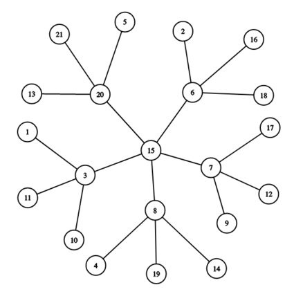

<h1 style='text-align: center;'> F. Forever Winter</h1>

<h5 style='text-align: center;'>time limit per test: 2 seconds</h5>
<h5 style='text-align: center;'>memory limit per test: 256 megabytes</h5>

A snowflake graph is generated from two integers $x$ and $y$, both greater than $1$, as follows: 

* Start with one central vertex.
* Connect $x$ new vertices to this central vertex.
* Connect $y$ new vertices to each of these $x$ vertices.

 For example, below is a snowflake graph for $x=5$ and $y=3$.  The snowflake graph above has a central vertex $15$, then $x=5$ vertices attached to it ($3$, $6$, $7$, $8$, and $20$), and then $y=3$ vertices attached to each of those. 

 Given a snowflake graph, determine the values of $x$ and $y$.## Input

The first line contains a single integer $t$ ($1 \leq t \leq 1000$) — the number of test cases.

The first line of each test case contains two integers $n$ and $m$ ($2 \leq n \leq 200$; $1 \leq m \leq \min\left(1000, \frac{n(n-1)}{2}\right)$) — the number of vertices and edges in the graph, respectively.

The next $m$ lines each contain two integers each $u$ and $v$ ($1 \leq u, v \leq n$, $u \neq v$) — the numbers of vertices connected by an edge. The graph does not contain multiple edges and self-loops.

It is guaranteed that this graph is a snowflake graph for some integers $x$ and $y$ both greater than $1$.

## Output

For each test case, on a separate line output the values of $x$ and $y$, in that order, separated by a space.

## Example

## Input


```

321 2021 205 2013 201 311 310 34 819 814 89 712 717 718 616 62 66 157 158 1520 153 157 61 21 32 42 53 63 79 89 33 66 22 15 22 74 33 8
```
## Output


```

5 3
2 2
2 3

```
## Note

The first test case is pictured in the statement. ## Note

 that the output 3 5 is incorrect, since $x$ should be output before $y$.


#### tags 

#1300 #dfs_and_similar #graphs #math 