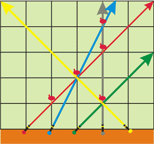

<h1 style='text-align: center;'> B. Zoo</h1>

<h5 style='text-align: center;'>time limit per test: 2 seconds</h5>
<h5 style='text-align: center;'>memory limit per test: 256 megabytes</h5>

The Zoo in the Grid Kingdom is represented by an infinite grid. The Zoo has *n* observation binoculars located at the *OX* axis. For each *i* between 1 and *n*, inclusive, there exists a single binocular located at the point with coordinates (*i*, 0). There are *m* flamingos in the Zoo, located at points with positive coordinates. The flamingos are currently sleeping and you can assume that they don't move.

In order to get a good view over the flamingos, each of the binoculars can be independently rotated to face any angle (not necessarily integer). Then, the binocular can be used to observe all flamingos that is located at the straight line passing through the binocular at the angle it is set. In other words, you can assign each binocular a direction corresponding to any straight line passing through the binocular, and the binocular will be able to see all flamingos located on that line.

Today, some kids from the prestigious Codeforces kindergarten went on a Field Study to the Zoo. Their teacher would like to set each binocular an angle to maximize the number of flamingos that can be seen by the binocular. The teacher is very interested in the sum of these values over all binoculars. Please help him find this sum.

## Input

The first line contains two space-separated integers *n* and *m* (1 ≤ *n* ≤ 106, 1 ≤ *m* ≤ 250), denoting the number of binoculars and the number of flamingos, respectively.

Then *m* lines follow, the *i*-th line will contain two space-separated integers *x**i* and *y**i* (1 ≤ *x**i*, *y**i* ≤ 109), which means that the *i*-th flamingo is located at point (*x**i*, *y**i*). 

All flamingos will be located at distinct points.

## Output

Print a single integer denoting the maximum total number of flamingos that can be seen by all the binoculars.

## Examples

## Input


```
5 5  
2 1  
4 1  
3 2  
4 3  
4 4  

```
## Output


```
11  

```
## Note

This picture shows the answer to the example test case. 

  

#### tags 

#1700 #brute_force #geometry 