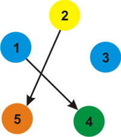

<h1 style='text-align: center;'> C. Cyclic Coloring</h1>

<h5 style='text-align: center;'>time limit per test: 4 seconds</h5>
<h5 style='text-align: center;'>memory limit per test: 256 megabytes</h5>

You are given a directed graph *G* with *n* vertices and *m* arcs (multiple arcs and self-loops are allowed). You have to paint each vertex of the graph into one of the *k* (*k* ≤ *n*) colors in such way that for all arcs of the graph leading from a vertex *u* to vertex *v*, vertex *v* is painted with the next color of the color used to paint vertex *u*.

The colors are numbered cyclically 1 through *k*. This means that for each color *i* (*i* < *k*) its next color is color *i* + 1. In addition, the next color of color *k* is color 1. ## Note

, that if *k* = 1, then the next color for color 1 is again color 1.

Your task is to find and print the largest possible value of *k* (*k* ≤ *n*) such that it's possible to color *G* as described above with *k* colors. ## Note

 that you don't necessarily use all the *k* colors (that is, for each color *i* there does not necessarily exist a vertex that is colored with color *i*).

## Input

The first line contains two space-separated integers *n* and *m* (1 ≤ *n*, *m* ≤ 105), denoting the number of vertices and the number of arcs of the given digraph, respectively.

Then *m* lines follow, each line will contain two space-separated integers *a**i* and *b**i* (1 ≤ *a**i*, *b**i* ≤ *n*), which means that the *i*-th arc goes from vertex *a**i* to vertex *b**i*.

Multiple arcs and self-loops are allowed.

## Output

Print a single integer — the maximum possible number of the colors that can be used to paint the digraph (i.e. *k*, as described in the problem statement). ## Note

 that the desired value of *k* must satisfy the inequality 1 ≤ *k* ≤ *n*.

## Examples

## Input


```
4 4  
1 2  
2 1  
3 4  
4 3  

```
## Output


```
2  

```
## Input


```
5 2  
1 4  
2 5  

```
## Output


```
5  

```
## Input


```
4 5  
1 2  
2 3  
3 1  
2 4  
4 1  

```
## Output


```
3  

```
## Input


```
4 4  
1 1  
1 2  
2 1  
1 2  

```
## Output


```
1  

```
## Note

For the first example, with *k* = 2, this picture depicts the two colors (arrows denote the next color of that color).

  With *k* = 2 a possible way to paint the graph is as follows.

  It can be proven that no larger value for *k* exists for this test case.

For the second example, here's the picture of the *k* = 5 colors.

  A possible coloring of the graph is:

  For the third example, here's the picture of the *k* = 3 colors.

  A possible coloring of the graph is:

  

#### tags 

#2200 #dfs_and_similar 