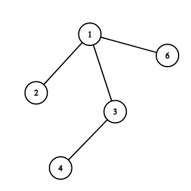
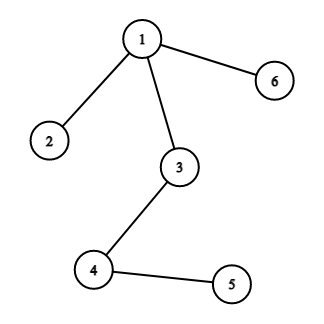

<h1 style='text-align: center;'> A. Copil Copac Draws Trees</h1>

<h5 style='text-align: center;'>time limit per test: 3 seconds</h5>
<h5 style='text-align: center;'>memory limit per test: 256 megabytes</h5>

Copil Copac is given a list of $n-1$ edges describing a tree of $n$ vertices. He decides to draw it using the following algorithm:

* Step $0$: Draws the first vertex (vertex $1$). Go to step $1$.
* Step $1$: For every edge in the input, in order: if the edge connects an already drawn vertex $u$ to an undrawn vertex $v$, he will draw the undrawn vertex $v$ and the edge. After checking every edge, go to step $2$.
* Step $2$: If all the vertices are drawn, terminate the algorithm. Else, go to step $1$.

The number of readings is defined as the number of times Copil Copac performs step $1$.

Find the number of readings needed by Copil Copac to draw the tree.

## Input

Each test contains multiple test cases. The first line of input contains a single integer $t$ ($1 \leq t \leq 10^4$) — the number of test cases. The description of test cases follows.

The first line of each test case contains a single integer $n$ ($2 \le n \le 2 \cdot 10^5$) — the number of vertices of the tree.

The following $n - 1$ lines of each test case contain two integers $u_i$ and $v_i$ ($1 \le u_i, v_i \le n$, $u_i \neq v_i$) — indicating that $(u_i,v_i)$ is the $i$-th edge in the list. It is guaranteed that the given edges form a tree.

It is guaranteed that the sum of $n$ over all test cases does not exceed $2 \cdot 10^5$.

## Output

For each test case, output the number of readings Copil Copac needs to draw the tree.

## Example

## Input


```

264 51 31 23 41 675 62 42 71 31 24 5
```
## Output


```

2
3

```
## Note

In the first test case:

After the first reading, the tree will look like this:

  After the second reading:

  Therefore, Copil Copac needs $2$ readings to draw the tree.


#### tags 

#1400 #dfs_and_similar #dp #graphs #trees 