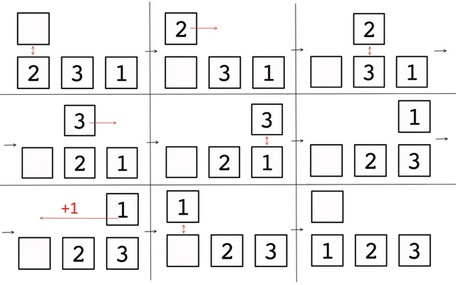

<h1 style='text-align: center;'> F. Typewriter</h1>

<h5 style='text-align: center;'>time limit per test: 3 seconds</h5>
<h5 style='text-align: center;'>memory limit per test: 256 megabytes</h5>

Recently, Polycarp was given an unusual typewriter as a gift! Unfortunately, the typewriter was defective and had a rather strange design.

The typewriter consists of $n$ cells numbered from left to right from $1$ to $n$, and a carriage that moves over them. The typewriter cells contain $n$ distinct integers from $1$ to $n$, and each cell $i$ initially contains the integer $p_i$. Before all actions, the carriage is at cell number $1$ and there is nothing in its buffer storage. The cell on which the carriage is located is called the current cell. 

The carriage can perform five types of operations:

* Take the integer from the current cell, if it is not empty, and put it in the carriage buffer, if it is empty (this buffer can contain no more than one integer).
* Put the integer from the carriage buffer, if it is not empty, into the current cell, if it is empty.
* Swap the number in the carriage buffer with the number in the current cell, if both the buffer and the cell contain integers.
* Move the carriage from the current cell $i$ to cell $i + 1$ (if $i < n$), while the integer in the buffer is preserved.
* Reset the carriage, i.e. move it to cell number $1$, while the integer in the buffer is preserved.

Polycarp was very interested in this typewriter, so he asks you to help him understand it and will ask you $q$ queries of three types:

1. Perform a cyclic shift of the sequence $p$ to the left by $k_j$.
2. Perform a cyclic shift of the sequence $p$ to the right by $k_j$.
3. Reverse the sequence $p$.

Before and after each query, Polycarp wants to know what minimum number of carriage resets is needed for the current sequence in order to distribute the numbers to their cells (so that the number $i$ ends up in cell number $i$).

## Note

 that Polycarp only wants to know the minimum number of carriage resets required to arrange the numbers in their places, but he does not actually distribute them.

Help Polycarp find the answers to his queries!

## Input

The first line contains a single integer $n$ ($1 \le n \le 4 \cdot 10^5$) — the number of cells.

The second line contains $n$ distinct integers $p_1, p_2, \ldots, p_n$ ($1 \le p_i \le n$) — the initial arrangement of integers in the cells.

The third line contains a single integer $q$ ($0 \le q \le 4 \cdot 10^5$) — the number of queries.

Each of the next $q$ lines describes a query from Polycarp:

The $j$-th line, at first, contains the integer $t_j$ ($1 \le t_j \le 3$)  — the type of query.

If the query is of type $t_j = 1$ or $t_j = 2$, then the integer $k_j$ ($1 \le k_j \le n$)  — the length of the shift  — follows in the same line.

## Output

## Output

 $q + 1$ numbers — the minimum number of carriage resets required before and after each of Polycarp's queries.

## Examples

## Input


```

3
2 3 1
0

```
## Output


```

1

```
## Input


```

3
1 2 3
2
2 1
3

```
## Output


```

0
2
1

```
## Input


```

5
3 1 2 5 4
5
1 3
3
2 3
1 4
3

```
## Output


```

3
2
1
2
1
2

```
## Note

In the first example, the answer is $1$. You can understand how the carriage works using this example.

  In the second example, the sequences for which the answer needs to be calculated look like this:

1. Before all queries: $1\ 2\ 3$ — the answer is $0$.
2. After shifting to the right by $1$: $3\ 1\ 2$ — the answer is $2$.
3. After reversing the sequence: $2\ 1\ 3$ — the answer is $1$.

In the third example, the sequences before and after each query look like this:

1. $3\ 1\ 2\ 5\ 4$ — the answer is $3$.
2. $5\ 4\ 3\ 1\ 2$ — the answer is $2$.
3. $2\ 1\ 3\ 4\ 5$ — the answer is $1$.
4. $3\ 4\ 5\ 2\ 1$ — the answer is $2$.
5. $1\ 3\ 4\ 5\ 2$ — the answer is $1$.
6. $2\ 5\ 4\ 3\ 1$ — the answer is $2$.


#### tags 

#2500 #brute_force #math 