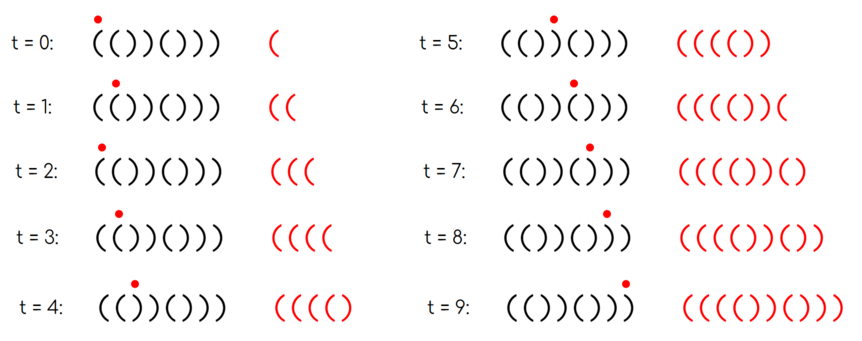

<h1 style='text-align: center;'> D. Bracket Walk</h1>

<h5 style='text-align: center;'>time limit per test: 3 seconds</h5>
<h5 style='text-align: center;'>memory limit per test: 256 megabytes</h5>

There is a string $s$ of length $n$ consisting of the characters '(' and ')'. You are walking on this string. You start by standing on top of the first character of $s$, and you want to make a sequence of moves such that you end on the $n$-th character. In one step, you can move one space to the left (if you are not standing on the first character), or one space to the right (if you are not standing on the last character). You may not stay in the same place, however you may visit any character, including the first and last character, any number of times.

At each point in time, you write down the character you are currently standing on. We say the string is walkable if there exists some sequence of moves that take you from the first character to the last character, such that the string you write down is a regular bracket sequence.

A regular bracket sequence is a bracket sequence that can be transformed into a correct arithmetic expression by inserting characters '1' and '+' between the original characters of the sequence. For example, bracket sequences "()()", "(())" are regular (the resulting expressions are: "(1)+(1)", "((1+1)+1)"), and ")(" and "(" are not.

One possible valid walk on $s=\mathtt{(())()))}$. The red dot indicates your current position, and the red string indicates the string you have written down. ## Note

 that the red string is a regular bracket sequence at the end of the process.You are given $q$ queries. Each query flips the value of a character from '(' to ')' or vice versa. After each query, determine whether the string is walkable.

Queries are cumulative, so the effects of each query carry on to future queries.

## Input

The first line of the input contains two integers $n$ and $q$ ($1 \le n, q \le 2\cdot 10^5$) — the size of the string and the number of queries, respectively.

The second line of the input contains a string $s$ of size $n$, consisting of the characters '(' and ')' — the initial bracket string.

Each of the next $q$ lines contains a single integer $i$ ($1\le i \le n$) — the index of the character to flip for that query.

## Output

For each query, print "YES" if the string is walkable after that query, and "NO" otherwise.

You can output the answer in any case (upper or lower). For example, the strings "yEs", "yes", "Yes", and "YES" will be recognized as positive responses.

## Examples

## Input


```

10 9
(())()()))
9
7
2
6
3
6
7
4
8

```
## Output


```

YES
YES
NO
NO
YES
NO
YES
NO
NO

```
## Input


```

3 2
(()
2
3

```
## Output


```

NO
NO

```
## Note

In the first example: 

* After the first query, the string is (())()()(). This string is a regular bracket sequence, so it is walkable by simply moving to the right.
* After the second query, the string is (())()))(). If you move right once, then left once, then walk right until you hit the end of the string, you produce the string (((())()))(), which is a regular bracket sequence.
* After the third query, the string is ()))()))(). We can show that this string is not walkable.

 In the second example, the strings after the queries are ()) and ()(, neither of which are walkable.

#### tags 

#2100 #data_structures #greedy #strings 