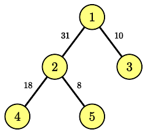

<h1 style='text-align: center;'> G. Tree Weights</h1>

<h5 style='text-align: center;'>time limit per test: 5 seconds</h5>
<h5 style='text-align: center;'>memory limit per test: 256 megabytes</h5>

You are given a tree with $n$ nodes labelled $1,2,\dots,n$. The $i$-th edge connects nodes $u_i$ and $v_i$ and has an unknown positive integer weight $w_i$. To help you figure out these weights, you are also given the distance $d_i$ between the nodes $i$ and $i+1$ for all $1 \le i \le n-1$ (the sum of the weights of the edges on the simple path between the nodes $i$ and $i+1$ in the tree).

Find the weight of each edge. If there are multiple solutions, print any of them. If there are no weights $w_i$ consistent with the information, print a single integer $-1$.

## Input

The first line contains a single integer $n$ ($2 \le n \le 10^5$).

The $i$-th of the next $n-1$ lines contains two integers $u_i$ and $v_i$ ($1 \le u_i,v_i \le n$, $u_i \ne v_i$).

The last line contains $n-1$ integers $d_1,\dots,d_{n-1}$ ($1 \le d_i \le 10^{12}$).

It is guaranteed that the given edges form a tree.

## Output

If there is no solution, print a single integer $-1$. Otherwise, output $n-1$ lines containing the weights $w_1,\dots,w_{n-1}$.

If there are multiple solutions, print any of them.

## Examples

## Input


```

5
1 2
1 3
2 4
2 5
31 41 59 26

```
## Output


```

31
10
18
8

```
## Input


```

3
1 2
1 3
18 18

```
## Output


```

-1

```
## Input


```

9
3 1
4 1
5 9
2 6
5 3
5 8
9 7
9 2
236 205 72 125 178 216 214 117

```
## Output


```

31
41
59
26
53
58
97
93

```
## Note

In the first sample, the tree is as follows:

  In the second sample, note that $w_2$ is not allowed to be $0$ because it must be a positive integer, so there is no solution.

In the third sample, the tree is as follows:

  

#### tags 

#3000 #bitmasks #constructive_algorithms #data_structures #dfs_and_similar #implementation #math #matrices #number_theory #trees 