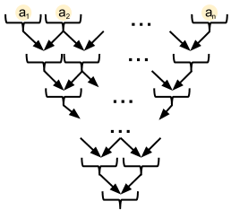

<h1 style='text-align: center;'> C. Clever Fat Rat</h1>

<h5 style='text-align: center;'>time limit per test: 2.5 seconds</h5>
<h5 style='text-align: center;'>memory limit per test: 256 megabytes</h5>

The Fat Rat and his friend Сerealguy have had a bet whether at least a few oats are going to descend to them by some clever construction. The figure below shows the clever construction.

  A more formal description of the clever construction is as follows. The clever construction consists of *n* rows with scales. The first row has *n* scales, the second row has (*n* - 1) scales, the *i*-th row has (*n* - *i* + 1) scales, the last row has exactly one scale. Let's number the scales in each row from the left to the right, starting from 1. Then the value of *w**i*, *k* in kilograms (1 ≤ *i* ≤ *n*; 1 ≤ *k* ≤ *n* - *i* + 1) is the weight capacity parameter of the *k*-th scale in the *i*-th row. 

If a body whose mass is not less than *w**i*, *k* falls on the scale with weight capacity *w**i*, *k*, then the scale breaks. At that anything that the scale has on it, either falls one level down to the left (if possible) or one level down to the right (if possible). In other words, if the scale *w**i*, *k* (*i* < *n*) breaks, then there are at most two possible variants in which the contents of the scale's pan can fall out: all contents of scale *w**i*, *k* falls either on scale *w**i* + 1, *k* - 1 (if it exists), or on scale *w**i* + 1, *k* (if it exists). If scale *w**n*, 1 breaks, then all its contents falls right in the Fat Rat's claws. Please note that the scales that are the first and the last in a row, have only one variant of dropping the contents.

Initially, oats are simultaneously put on all scales of the first level. The *i*-th scale has *a**i* kilograms of oats put on it. After that the scales start breaking and the oats start falling down in some way. You can consider everything to happen instantly. That is, the scale breaks instantly and the oats also fall instantly.

The Fat Rat is sure that whatever happens, he will not get the oats from the first level. Cerealguy is sure that there is such a scenario, when the rat gets at least some number of the oats. Help the Fat Rat and the Cerealguy. Determine, which one is right.

## Input

The first line contains a single integer *n* (1 ≤ *n* ≤ 50) — the number of rows with scales.

The next line contains *n* space-separated integers *a**i* (1 ≤ *a**i* ≤ 106) — the masses of the oats in kilograms.

The next *n* lines contain descriptions of the scales: the *i*-th line contains (*n* - *i* + 1) space-separated integers *w**i*, *k* (1 ≤ *w**i*, *k* ≤ 106) — the weight capacity parameters for the scales that stand on the *i*-th row, in kilograms.

## Output

Print "Fat Rat" if the Fat Rat is right, otherwise print "Cerealguy".

## Examples

## Input


```
1  
1  
2  

```
## Output


```
Fat Rat  

```
## Input


```
2  
2 2  
1 2  
4  

```
## Output


```
Cerealguy  

```
## Input


```
2  
2 2  
1 2  
5  

```
## Output


```
Fat Rat  

```
## Note

## Note

s to the examples: 

* The first example: the scale with weight capacity 2 gets 1. That means that the lower scale don't break.
* The second sample: all scales in the top row obviously break. Then the oats fall on the lower row. Their total mass is 4,and that's exactly the weight that the lower scale can "nearly endure". So, as 4  ≥  4, the scale breaks.


#### tags 

#2500 #dp 