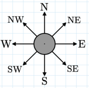

<h1 style='text-align: center;'> G. The Morning Star</h1>

<h5 style='text-align: center;'>time limit per test: 2 seconds</h5>
<h5 style='text-align: center;'>memory limit per test: 256 megabytes</h5>

A compass points directly toward the morning star. It can only point in one of eight directions: the four cardinal directions (N, S, E, W) or some combination (NW, NE, SW, SE). Otherwise, it will break.

  The directions the compass can point. There are $n$ distinct points with integer coordinates on a plane. How many ways can you put a compass at one point and the morning star at another so that the compass does not break?

## Input

Each test contains multiple test cases. The first line contains the number of test cases $t$ ($1 \le t \le 10^4$). The description of the test cases follows.

The first line of each test case contains a single integer $n$ ($2 \leq n \leq 2 \cdot 10^5$) — the number of points.

Then $n$ lines follow, each line containing two integers $x_i$, $y_i$ ($-10^9 \leq x_i, y_i \leq 10^9$) — the coordinates of each point, all points have distinct coordinates.

It is guaranteed that the sum of $n$ over all test cases doesn't exceed $2 \cdot 10^5$.

## Output

For each test case, output a single integer — the number of pairs of points that don't break the compass.

## Example

## Input


```

530 0-1 -11 144 55 76 910 133-1000000000 10000000000 01000000000 -100000000050 02 2-1 5-1 102 1130 0-1 21 -2
```
## Output


```

6
2
6
8
0

```
## Note

In the first test case, any pair of points won't break the compass: 

* The compass is at $(0,0)$, the morning star is at $(-1,-1)$: the compass will point $\text{SW}$.
* The compass is at $(0,0)$, the morning star is at $(1,1)$: the compass will point $\text{NE}$.
* The compass is at $(-1,-1)$, the morning star is at $(0,0)$: the compass will point $\text{NE}$.
* The compass is at $(-1,-1)$, the morning star is at $(1,1)$: the compass will point $\text{NE}$.
* The compass is at $(1,1)$, the morning star is at $(0,0)$: the compass will point $\text{SW}$.
* The compass is at $(1,1)$, the morning star is at $(-1,-1)$: the compass will point $\text{SW}$.

In the second test case, only two pairs of points won't break the compass: 

* The compass is at $(6,9)$, the morning star is at $(10,13)$: the compass will point $\text{NE}$.
* The compass is at $(10,13)$, the morning star is at $(6,9)$: the compass will point $\text{SW}$.


#### tags 

#1500 #combinatorics #data_structures #geometry #implementation #math #sortings 