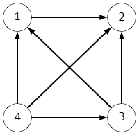

<h1 style='text-align: center;'> D. Strong Vertices</h1>

<h5 style='text-align: center;'>time limit per test: 2 seconds</h5>
<h5 style='text-align: center;'>memory limit per test: 256 megabytes</h5>

Given two arrays $a$ and $b$, both of length $n$. Elements of both arrays indexed from $1$ to $n$. You are constructing a directed graph, where edge from $u$ to $v$ ($u\neq v$) exists if $a_u-a_v \ge b_u-b_v$.

A vertex $V$ is called strong if there exists a path from $V$ to all other vertices.

A path in a directed graph is a chain of several vertices, connected by edges, such that moving from the vertex $u$, along the directions of the edges, the vertex $v$ can be reached.

Your task is to find all strong vertices.

For example, if $a=[3,1,2,4]$ and $b=[4,3,2,1]$, the graph will look like this: 

  The graph has only one strong vertex with number $4$ ## Input

The first line contains an integer $t$ ($1\le t\le 10^4$) — the number of test cases.

The first line of each test case contains an integer $n$ ($2 \le n \le 2\cdot 10^5$) — the length of $a$ and $b$.

The second line of each test case contains $n$ integers $a_1,a_2 \dots a_n$ ($-10^9 \le a_i \le 10^9$) — the array $a$.

The third line of each test case contains $n$ integers $b_1,b_2 \dots b_n$ ($-10^9 \le b_i \le 10^9$) — the array $b$.

It is guaranteed that the sum of $n$ for all test cases does not exceed $2\cdot 10^5$.

## Output

For each test case, output two lines: in the first line, output the number of strong vertices, and in the second line, output all strong vertices in ascending order.

## Example

## Input


```

543 1 2 44 3 2 151 2 4 1 25 2 3 3 121 22 130 2 11 3 235 7 4-2 -3 -6
```
## Output


```

1
4 
2
3 5 
1
2 
3
1 2 3 
2
2 3 

```
## Note

The first sample is covered in the problem statement.

For the second sample, the graph looks like this: 

  The graph has two strong vertices with numbers $3$ and $5$. ## Note

 that there is a bidirectional edge between vertices $3$ and $5$. In the third sample, the vertices are connected by a single directed edge from vertex $2$ to vertex $1$, so the only strong vertex is $2$.

In the fourth sample, all vertices are connected to each other by bidirectional edges, so there is a path from every vertex to any other vertex.


#### tags 

#1300 #math #sortings #trees 