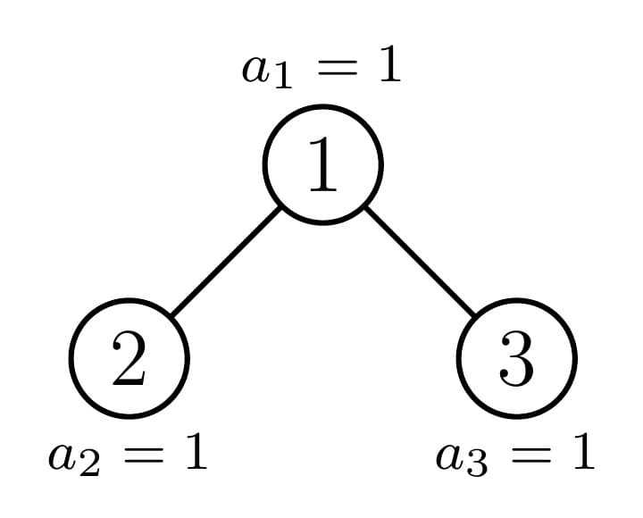
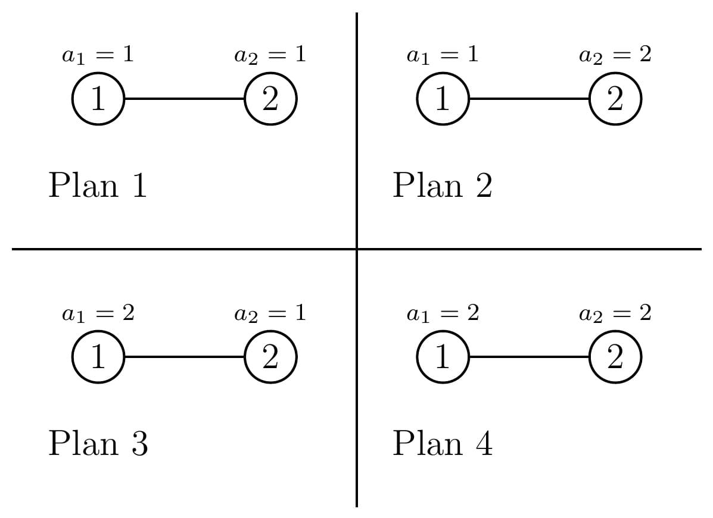

<h1 style='text-align: center;'> C. Travel Plan</h1>

<h5 style='text-align: center;'>time limit per test: 2 seconds</h5>
<h5 style='text-align: center;'>memory limit per test: 512 megabytes</h5>

During the summer vacation after Zhongkao examination, Tom and Daniel are planning to go traveling.

There are $n$ cities in their country, numbered from $1$ to $n$. And the traffic system in the country is very special. For each city $i$ ($1 \le i \le n$), there is

* a road between city $i$ and $2i$, if $2i\le n$;
* a road between city $i$ and $2i+1$, if $2i+1\le n$.

Making a travel plan, Daniel chooses some integer value between $1$ and $m$ for each city, for the $i$-th city we denote it by $a_i$.

Let $s_{i,j}$ be the maximum value of cities in the simple$^\dagger$ path between cities $i$ and $j$. The score of the travel plan is $\sum_{i=1}^n\sum_{j=i}^n s_{i,j}$. 

Tom wants to know the sum of scores of all possible travel plans. Daniel asks you to help him find it. You just need to tell him the answer modulo $998\,244\,353$.

$^\dagger$ A simple path between cities $x$ and $y$ is a path between them that passes through each city at most once.

## Input

The first line of input contains a single integer $t$ ($1\le t\le 200$) — the number of test cases. The description of test cases follows.

The only line of each test case contains two integers $n$ and $m$ ($1\leq n\leq 10^{18}$, $1\leq m\leq 10^5$) — the number of the cities and the maximum value of a city.

It is guaranteed that the sum of $m$ over all test cases does not exceed $10^5$.

## Output

For each test case output one integer — the sum of scores of all possible travel plans, modulo $998\,244\,353$.

## Example

## Input


```

53 12 210 943 20154 147
```
## Output


```

6
19
583217643
68816635
714002110

```
## Note

In the first test case, there is only one possible travel plan:

  Path $1\rightarrow 1$: $s_{1,1}=a_1=1$.

Path $1\rightarrow 2$: $s_{1,2}=\max(1,1)=1$.

Path $1\rightarrow 3$: $s_{1,3}=\max(1,1)=1$.

Path $2\rightarrow 2$: $s_{2,2}=a_2=1$.

Path $2\rightarrow 1\rightarrow 3$: $s_{2,3}=\max(1,1,1)=1$.

Path $3\rightarrow 3$: $s_{3,3}=a_3=1$.

The score is $1+1+1+1+1+1=6$.

In the second test case, there are four possible travel plans:

  Score of plan $1$: $1+1+1=3$.

Score of plan $2$: $1+2+2=5$.

Score of plan $3$: $2+2+1=5$.

Score of plan $4$: $2+2+2=6$.

Therefore, the sum of score is $3+5+5+6=19$.


#### tags 

#2400 #combinatorics #dp #implementation #math #trees 