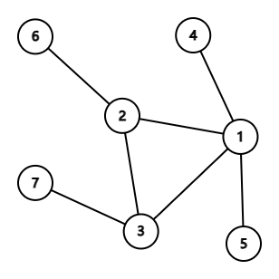

<h1 style='text-align: center;'> D. Flower-like Pseudotree</h1>

<h5 style='text-align: center;'>time limit per test: 3 seconds</h5>
<h5 style='text-align: center;'>memory limit per test: 512 megabytes</h5>

A pseudotree is a connected graph which has exactly one cycle and no self-loops. ## Note

 that a pseudotree may contain multiple-edges. It can be shown that a pseudotree with $n$ vertices always contains $n$ edges.

After deleting all edges on the cycle in the pseudotree, a forest$^{\dagger}$ will be formed. It can be shown that each tree in the forest will contain exactly one vertex which is on cycle before removing the edges. If all trees in the forest have the same depth$^{\ddagger}$ when picking the vertex on cycle as root, we call the original pseudotree flower-like.

Our friend sszcdjr, had a flower-like pseudotree with $n$ vertices and $n$ edges. However, he forgot all the edges in the pseudotree. Fortunately, he still remembers the degrees of vertices. Specifically, the degree of the $i$-th vertex is $d_i$.

You have to help sszcdjr construct a possible flower-like pseudotree with $n$ vertices, where the degree of the $i$-th vertex is exactly $d_i$, or tell him that it is impossible.

$^{\dagger}$ A forest is a graph in which all connectivity components are trees. A connected graph without cycles and self-loops is called a tree.

$^{\ddagger}$ The depth of a tree with a root is the maximum distance from the root to the vertex of this tree.

## Input

The first line of the input contains a single integer $t$ ($1\leq t\leq 10^5$) — the number of test cases. The description of test cases follows.

The first line of each test case contains a single integer $n$ ($2\leq n\leq 10^6$) — the number of vertices.

The second line of each test case contains $n$ integers $d_1,d_2,\ldots,d_n$ ($1\leq d_i\leq n$) — the degree of each vertex.

It is guaranteed that the sum of $n$ over all test cases does not exceed $10^6$.

## Output

For each test case, if there exist a possible flower-like pseudotree:

* Print "Yes" (without quotes) in the first line.
* Then, output $n$ lines, in each line print two integers $u_i$ and $v_i$ — the two vertices that the $i$-th edge connects.

If there are multiple answers, you may output any of them.

Otherwise, print "No" (without quotes) in the only line of output.

You can output the first line of each test case in any case (upper or lower). For example, the strings "yEs", "yes", "Yes", and "YES" will be recognized as positive responses.

## Example

## Input


```

632 2 241 2 3 474 3 3 1 1 1 161 1 2 2 3 3101 1 5 2 1 1 1 1 1 691 1 3 1 1 4 1 1 5
```
## Output


```

Yes
1 2
2 3
3 1
No
Yes
1 2
2 3
3 1
1 4
1 5
2 6
3 7
Yes
5 6
6 5
1 3
2 4
3 5
4 6
No
Yes
3 6
6 9
9 3
1 3
2 6
4 6
5 9
7 9
8 9

```
## Note

In the first test case, the only possible flower-like psuedotree is:

  After deleting all edges on the cycle in the pseudotree, each tree has depth $0$.

In the second test case, it can be proven that there's no such flower-like psuedotree.

In the third test case, one of the possible flower-like psuedotrees is:

  

#### tags 

#3000 #constructive_algorithms #graphs #greedy #implementation #trees 