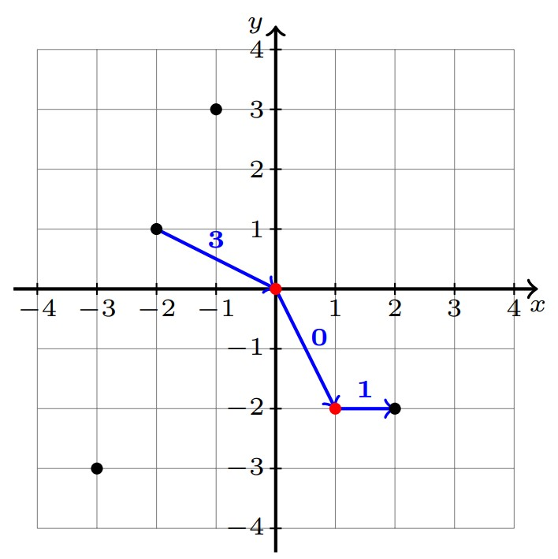

<h1 style='text-align: center;'> B. 2D Traveling</h1>

<h5 style='text-align: center;'>time limit per test: 1 second</h5>
<h5 style='text-align: center;'>memory limit per test: 256 megabytes</h5>

Piggy lives on an infinite plane with the Cartesian coordinate system on it.

There are $n$ cities on the plane, numbered from $1$ to $n$, and the first $k$ cities are defined as major cities. The coordinates of the $i$-th city are $(x_i,y_i)$.

Piggy, as a well-experienced traveller, wants to have a relaxing trip after Zhongkao examination. Currently, he is in city $a$, and he wants to travel to city $b$ by air. You can fly between any two cities, and you can visit several cities in any order while travelling, but the final destination must be city $b$.

Because of active trade between major cities, it's possible to travel by plane between them for free. Formally, the price of an air ticket $f(i,j)$ between two cities $i$ and $j$ is defined as follows:

$$ f(i,j)= \begin{cases} 0, & \text{if cities }i \text{ and }j \text{ are both major cities} \\\ |x_i-x_j|+|y_i-y_j|, & \text{otherwise} \end{cases} $$

Piggy doesn't want to save time, but he wants to save money. So you need to tell him the minimum value of the total cost of all air tickets if he can take any number of flights.

## Input

The first line of input contains a single integer $t$ ($1\le t\le 10^4$) — the number of test cases. The description of test cases follows.

The first line of each test case contains four integers $n$, $k$, $a$ and $b$ ($2\le n\le 2\cdot 10^5$, $0\le k\le n$, $1\le a,b\le n$, $a\ne b$) — the number of cities, the number of major cities and the numbers of the starting and the ending cities.

Then $n$ lines follow, the $i$-th line contains two integers $x_i$ and $y_i$ ($-10^9\le x_i,y_i\le 10^9$) — the coordinates of the $i$-th city. The first $k$ lines describe major cities. It is guaranteed that all coordinates are pairwise distinct.

It is guaranteed that the sum of $n$ over all test cases does not exceed $2\cdot 10^5$.

## Output

For each test case, print a single integer — the minimum value of the total price of all air tickets.

## Example

## Input


```

56 2 3 50 01 -2-2 1-1 32 -2-3 -32 0 1 2-1000000000 -10000000001000000000 10000000007 5 4 2154 147-154 -147123 45620 2343 20998 244353 1003 1 3 10 101 202 304 3 2 40 0-100 100-1 -1-1 0
```
## Output


```

4
4000000000
0
22
1

```
## Note

In the first test case:

  The major cities are marked red. The optimal way to choose the flights is: $3\rightarrow 1 \rightarrow 2 \rightarrow 5$, which will cost $3+0+1=4$. ## Note

 that the flight $1\rightarrow 2$ costs $0$, because both city $1$ and $2$ are major cities.

In the second test case, since there are only $2$ cities, the only way is to take a flight from city $1$ to $2$.

In the third test case, since city $2$ and $4$ are both major cities, Piggy can directly take a flight from city $2$ to $4$, which costs $0$.

In the fourth test case, Piggy can choose to take the following flights: $3\rightarrow 2\rightarrow 1$, and the cost is $11+11=22$.


#### tags 

#1100 #geometry #math #shortest_paths #sortings 