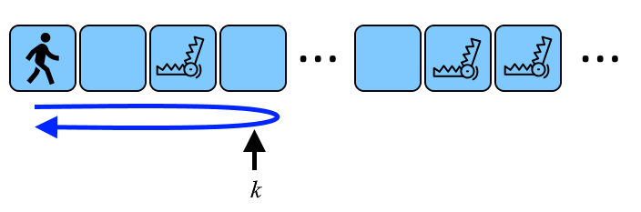

<h1 style='text-align: center;'> B. The Corridor or There and Back Again</h1>

<h5 style='text-align: center;'>time limit per test: 2 seconds</h5>
<h5 style='text-align: center;'>memory limit per test: 256 megabytes</h5>

You are in a corridor that extends infinitely to the right, divided into square rooms. You start in room $1$, proceed to room $k$, and then return to room $1$. You can choose the value of $k$. Moving to an adjacent room takes $1$ second.

Additionally, there are $n$ traps in the corridor: the $i$-th trap is located in room $d_i$ and will be activated $s_i$ seconds after you enter the room $\boldsymbol{d_i}$. Once a trap is activated, you cannot enter or exit a room with that trap.

  A schematic representation of a possible corridor and your path to room $k$ and back. Determine the maximum value of $k$ that allows you to travel from room $1$ to room $k$ and then return to room $1$ safely.

For instance, if $n=1$ and $d_1=2, s_1=2$, you can proceed to room $k=2$ and return safely (the trap will activate at the moment $1+s_1=1+2=3$, it can't prevent you to return back). But if you attempt to reach room $k=3$, the trap will activate at the moment $1+s_1=1+2=3$, preventing your return (you would attempt to enter room $2$ on your way back at second $3$, but the activated trap would block you). Any larger value for $k$ is also not feasible. Thus, the answer is $k=2$.

## Input

The first line of the input contains an integer $t$ ($1 \le t \le 1000$) — the number of test cases.

The descriptions of the test cases follow.

The first line of each test case description contains an integer $n$ ($1 \le n \le 100$) — the number of traps.

The following $n$ lines of each test case description present two integers $d_i$ and $s_i$ ($1 \le d_i, s_i \le 200$) — the parameters of a trap (you must leave room $d_i$ strictly before $s_i$ seconds have passed since entering this room). It's possible for multiple traps to occupy a single room (the values of $d_i$ can be repeated).

## Output

For each test case, print the maximum value of $k$ that allows you to travel to room $k$ and return to room $1$ without encountering an active trap.

## Example

## Input


```

712 232 84 35 21200 20041 205 93 179100 1210 11 1821 11 231 31 11 3
```
## Output


```

2
5
299
9
9
1
1

```
## Note

The first test case is explained in the problem statement above.

In the second test case, the second trap prevents you from achieving $k\ge6$. If $k\ge6$, the second trap will activate at the moment $3+s_2=3+3=6$ (the time you enter room $4$ plus $s_2$). In the case of $k\ge6$, you will return to room $4$ at time $7$ or later. The trap will be active at that time. It can be shown that room $k=5$ can be reached without encountering an active trap.

In the third test case, you can make it to room $299$ and then immediately return to room $1$.


#### tags 

#900 #greedy #implementation 