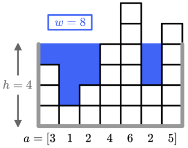

<h1 style='text-align: center;'> E. Building an Aquarium</h1>

<h5 style='text-align: center;'>time limit per test: 2 seconds</h5>
<h5 style='text-align: center;'>memory limit per test: 256 megabytes</h5>

You love fish, that's why you have decided to build an aquarium. You have a piece of coral made of $n$ columns, the $i$-th of which is $a_i$ units tall. Afterwards, you will build a tank around the coral as follows: 

* Pick an integer $h \geq 1$ — the height of the tank. Build walls of height $h$ on either side of the tank.
* Then, fill the tank up with water so that the height of each column is $h$, unless the coral is taller than $h$; then no water should be added to this column.

 For example, with $a=[3,1,2,4,6,2,5]$ and a height of $h=4$, you will end up using a total of $w=8$ units of water, as shown.    You can use at most $x$ units of water to fill up the tank, but you want to build the biggest tank possible. What is the largest value of $h$ you can select?## Input

The first line contains a single integer $t$ ($1 \leq t \leq 10^4$) — the number of test cases.

The first line of each test case contains two positive integers $n$ and $x$ ($1 \leq n \leq 2 \cdot 10^5$; $1 \leq x \leq 10^9$) — the number of columns of the coral and the maximum amount of water you can use.

The second line of each test case contains $n$ space-separated integers $a_i$ ($1 \leq a_i \leq 10^9$) — the heights of the coral.

The sum of $n$ over all test cases doesn't exceed $2 \cdot 10^5$.

## Output

For each test case, output a single positive integer $h$ ($h \geq 1$) — the maximum height the tank can have, so you need at most $x$ units of water to fill up the tank.

We have a proof that under these constraints, such a value of $h$ always exists.

## Example

## Input


```

57 93 1 2 4 6 2 53 101 1 14 11 4 3 46 19842 6 5 9 1 81 10000000001
```
## Output


```

4
4
2
335
1000000001

```
## Note

The first test case is pictured in the statement. With $h=4$ we need $8$ units of water, but if $h$ is increased to $5$ we need $13$ units of water, which is more than $x=9$. So $h=4$ is optimal.

In the second test case, we can pick $h=4$ and add $3$ units to each column, using a total of $9$ units of water. It can be shown that this is optimal.

In the third test case, we can pick $h=2$ and use all of our water, so it is optimal.


#### tags 

#1100 #binary_search #sortings 