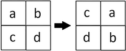

<h1 style='text-align: center;'> C. Perfect Square</h1>

<h5 style='text-align: center;'>time limit per test: 2 seconds</h5>
<h5 style='text-align: center;'>memory limit per test: 256 megabytes</h5>

Kristina has a matrix of size $n$ by $n$, filled with lowercase Latin letters. The value of $n$ is even.

She wants to change some characters so that her matrix becomes a perfect square. A matrix is called a perfect square if it remains unchanged when rotated $90^\circ$ clockwise once.

Here is an example of rotating a matrix by $90^\circ$:

  In one operation, Kristina can choose any cell and replace its value with the next character in the alphabet. If the character is equal to "z", its value does not change.

Find the minimum number of operations required to make the matrix a perfect square.

For example, if the $4$ by $4$ matrix looks like this:

$$\matrix{ a & b & b & a \cr b & c & \textbf{b} & b \cr b & c & c & b\cr a & b & b & a \cr }$$

then it is enough to apply $1$ operation to the letter b, highlighted in bold.

## Input

The first line of the input contains a single integer $t$ ($1 \le t \le 10^2$) — the number of test cases.

Then follows the description of each test case.

The first line of each test case contains a single even integer $n$ ($2 \le n \le 10^3$) — the number of rows and columns in the matrix.

Then follows $n$ lines, each containing exactly $n$ lowercase Latin letters.

It is guaranteed that the sum of $n$ over all test cases does not exceed $10^3$.

## Output

For each test case, output a single number on a separate line: the minimum number of operations required for Kristina to obtain a perfect square.

## Example

## Input


```

54abbabcbbbccbabba2abba6codeforcescodeforcescodeforcescodefo4baaaabbabababaab4bbaaabbaaabaabba
```
## Output


```

1
2
181
5
9

```
## Note

The first test case is explained in the problem statement.


#### tags 

#1200 #brute_force #implementation 