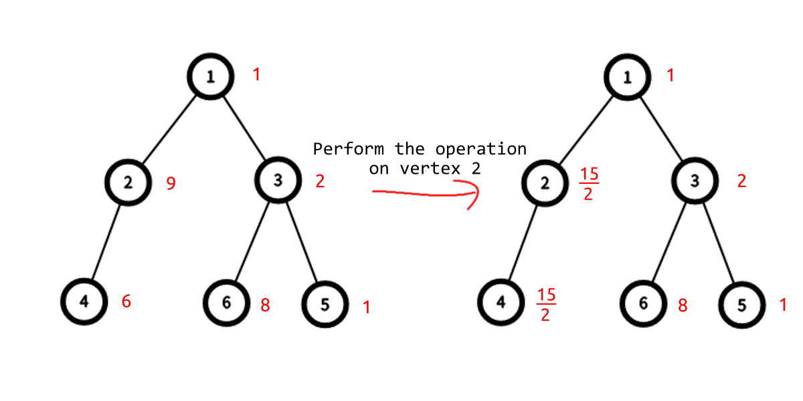

<h1 style='text-align: center;'> F. Doremy's Average Tree</h1>

<h5 style='text-align: center;'>time limit per test: 3 seconds</h5>
<h5 style='text-align: center;'>memory limit per test: 1024 megabytes</h5>

Doremy has a rooted tree of size $n$ whose root is vertex $r$. Initially there is a number $w_i$ written on vertex $i$. Doremy can use her power to perform this operation at most $k$ times:

1. Choose a vertex $x$ ($1 \leq x \leq n$).
2. Let $s = \frac{1}{|T|}\sum_{i \in T} w_i$ where $T$ is the set of all vertices in $x$'s subtree.
3. For all $i \in T$, assign $w_i := s$.

Doremy wants to know what is the lexicographically smallest$^\dagger$ array $w$ after performing all the operations. Can you help her?

If there are multiple answers, you may output any one.

$^\dagger$ For arrays $a$ and $b$ both of length $n$, $a$ is lexicographically smaller than $b$ if and only if there exist an index $i$ ($1 \leq i \le n$) such that $a_i < b_i$ and for all indices $j$ such that $j<i$, $a_j=b_j$ is satisfied.

## Input

The input consists of multiple test cases. The first line contains a single integer $t$ ($1\le t\le 10^4$) — the number of test cases. The description of the test cases follows.

The first line contains three integers $n$, $r$, $k$ ($2 \le n \le 5000$, $1 \le r \le n$, $0 \le k \le \min(500,n)$).

The second line contains $n$ integers $w_1,w_2,\ldots,w_n$ ($1 \le w_i \le 10^6$).

Each of the next $n-1$ lines contains two integers $u_i$, $v_i$ ($1 \leq u_i, v_i \leq n$), representing an edge between $u_i$ and $v_i$.

It is guaranteed that the given edges form a tree.

It is guaranteed that the sum of $n$ does not exceed $50\,000$.

## Output

For each test case, In the first line, output a single integer $cnt$ ($0 \le cnt \le k$) — the number of operations you perform.

Then, in the second line output $cnt$ integers $p_1,p_2,\ldots,p_{cnt}$ — $x$ is chosen to be $p_i$ for $i$-th operation.

If there are multiple answers, you may output any one.

## Example

## Input


```

46 1 11 9 2 6 1 81 21 32 43 63 57 7 23 1 3 3 1 1 27 17 27 41 52 34 66 5 13 1 3 1 1 35 35 15 63 41 23 2 11000000 999999 9999972 11 3
```
## Output


```

1
2
2
1 4
1
5
1
1

```
## Note

In the first test case:



At first $w=[1,9,2,6,1,8]$. You can choose some vertex $x$ to perform at most one operation.

* If $x=1$, $w=[\frac{9}{2},\frac{9}{2},\frac{9}{2},\frac{9}{2},\frac{9}{2},\frac{9}{2}]$.
* If $x=2$, $w=[1,\frac{15}{2},2,\frac{15}{2},1,8]$.
* If $x=3$, $w=[1,9,\frac{11}{3},6,\frac{11}{3},\frac{11}{3}]$.
* If $x \in \{4, 5, 6\}$, $w=[1,9,2,6,1,8]$.
* If you don't perform any operation, $w=[1,9,2,6,1,8]$.

$w$ is lexicographically smallest when $x=2$.


#### tags 

#3500 #data_structures #dp #greedy #trees 