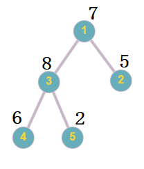

<h1 style='text-align: center;'> F. A Growing Tree</h1>

<h5 style='text-align: center;'>time limit per test: 2 seconds</h5>
<h5 style='text-align: center;'>memory limit per test: 256 megabytes</h5>

You are given a rooted tree with the root at vertex $1$, initially consisting of a single vertex. Each vertex has a numerical value, initially set to $0$. There are also $q$ queries of two types: 

* The first type: add a child vertex with the number $sz + 1$ to vertex $v$, where $sz$ is the current size of the tree. The numerical value of the new vertex will be $0$.
* The second type: add $x$ to the numerical values of all vertices in the subtree of vertex $v$.

After all queries, output the numerical value of all of the vertices in the final tree.

## Input

The first line contains a single integer $T$ ($1 \leq T \leq 10^4$) — the number of test cases. The descriptions of the test cases follow.

The first line of each test case contains a single integer $q$ ($1 \leq q \leq 5 \cdot 10^5$) — the number of queries.

The following $q$ lines can fall into two cases: 

* The first type of query: The $i$-th line contains two integers $t_i$ ($t_i = 1$), $v_i$. You need to add a child with the number $sz + 1$ to vertex $v_i$, where $sz$ is the current size of the tree. It is guaranteed that $1 \leq v_i \leq sz$.
* The second type of query: The $i$-th line contains three integers $t_i$ ($t_i = 2$), $v_i$, $x_i$ ($-10^9 \leq x_i \leq 10^9$). You need to add $x_i$ to all numerical values of vertices in the subtree of $v_i$. It is guaranteed that $1 \leq v_i \leq sz$, where $sz$ is the current size of the tree.

It is guaranteed that the sum of $q$ across all test cases does not exceed $5 \cdot 10^5$.

## Output

For each test case, output the numerical value of each vertex of the final tree after all queries have been performed.

## Example

## Input


```

392 1 31 12 2 11 12 3 21 32 1 41 32 3 252 1 11 12 1 -11 12 1 151 11 12 1 12 1 32 2 10
```
## Output


```

7 5 8 6 2 
1 0 1 
4 14 4 

```
## Note

In the first case, the final tree with the assigned numerical values will look like this: 

  The final tree with the assigned numerical values 

#### tags 

#2000 #data_structures #dfs_and_similar #trees 