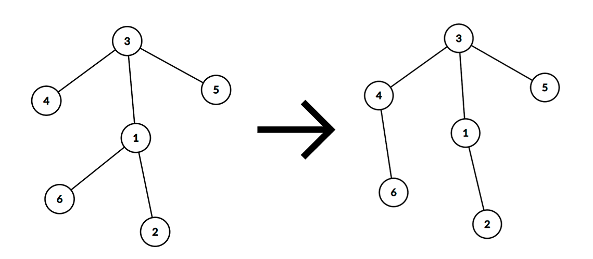

<h1 style='text-align: center;'> F. Alex's whims</h1>

<h5 style='text-align: center;'>time limit per test: 1 second</h5>
<h5 style='text-align: center;'>memory limit per test: 256 megabytes</h5>

Tree is a connected graph without cycles. It can be shown that any tree of $n$ vertices has exactly $n - 1$ edges.

Leaf is a vertex in the tree with exactly one edge connected to it.

Distance between two vertices $u$ and $v$ in a tree is the minimum number of edges that must be passed to come from vertex $u$ to vertex $v$.

Alex's birthday is coming up, and Timofey would like to gift him a tree of $n$ vertices. However, Alex is a very moody boy. Every day for $q$ days, he will choose an integer, denoted by the integer chosen on the $i$-th day by $d_i$. If on the $i$-th day there are not two leaves in the tree at a distance exactly $d_i$, Alex will be disappointed.

Timofey decides to gift Alex a designer so that he can change his tree as he wants. Timofey knows that Alex is also lazy (a disaster, not a human being), so at the beginning of every day, he can perform no more than one operation of the following kind:

* Choose vertices $u$, $v_1$, and $v_2$ such that there is an edge between $u$ and $v_1$ and no edge between $u$ and $v_2$. Then remove the edge between $u$ and $v_1$ and add an edge between $u$ and $v_2$. This operation cannot be performed if the graph is no longer a tree after it.

Somehow Timofey managed to find out all the $d_i$. After that, he had another brilliant idea — just in case, make an instruction manual for the set, one that Alex wouldn't be disappointed.

Timofey is not as lazy as Alex, but when he saw the integer $n$, he quickly lost the desire to develop the instruction and the original tree, so he assigned this task to you. It can be shown that a tree and a sequence of operations satisfying the described conditions always exist.



Here is an example of an operation where vertices were selected: $u$ — $6$, $v_1$ — $1$, $v_2$ — $4$.

## Input

The first line contains the integer $t$ ($1 \leq t \leq 100$) — the number of test cases.

The first line of each test case contains two integers $n$ ($3 \leq n \leq 500$) and $q$ ($1 \leq q \leq 500$) — the number of nodes in the tree and the number of days, respectively.

The $i$th of the following $q$ lines contains the integer $d_i$ ($2 \leq d_i \leq n - 1$).

It is guaranteed that the sum of $n$ over all test cases does not exceed $500$. The same is guaranteed for $q$.

It can be shown that a tree and a sequence of operations satisfying the described conditions always exist.

## Output

For each test case, first print an $n - 1$ string describing the edges of the tree. If you want the tree to have an edge between nodes $u$ and $v$, there must be a string $v$ $u$ or $u$ $v$ among these $n - 1$ lines.

In the next $q$ lines, print three integers each $u$ $v_1$ $v_2$ — a description of the operations. If Alex doesn't need to perform an operation the following day, print $-1$ $-1$ $-1$.

## Example

## Input


```

33 32225 64234324 9233222322
```
## Output


```

1 2
2 3
-1 -1 -1
-1 -1 -1
-1 -1 -1
1 2
2 3
3 4
4 5
-1 -1 -1
4 3 2
5 4 3
4 2 5
4 5 2
5 3 4
1 2
2 3
3 4
4 3 2
4 2 3
-1 -1 -1
4 3 2
-1 -1 -1
-1 -1 -1
4 2 3
4 3 2
-1 -1 -1

```


#### tags 

#1600 #constructive_algorithms #graphs #greedy #shortest_paths #trees 