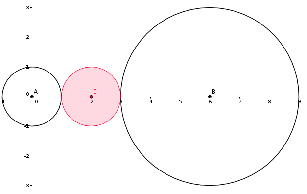
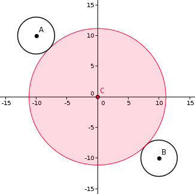

<h1 style='text-align: center;'> B. Surrounded</h1>

<h5 style='text-align: center;'>time limit per test: 1 second</h5>
<h5 style='text-align: center;'>memory limit per test: 256 megabytes</h5>

So, the Berland is at war with its eternal enemy Flatland again, and Vasya, an accountant, was assigned to fulfil his duty to the nation. 

Right now the situation in Berland is dismal — their both cities are surrounded! The armies of flatlanders stand on the borders of circles, the circles' centers are in the surrounded cities. At any moment all points of the flatland ring can begin to move quickly in the direction of the city — that's the strategy the flatlanders usually follow when they besiege cities.

The berlanders are sure that they can repel the enemy's attack if they learn the exact time the attack starts. For that they need to construct a radar that would register any movement at the distance of at most *r* from it. Thus, we can install a radar at such point, that at least one point of the enemy ring will be in its detecting range (that is, at a distance of at most *r*). Then the radar can immediately inform about the enemy's attack. 

Due to the newest technologies, we can place a radar at any point without any problems. But the problem is that the berlanders have the time to make only one radar. Besides, the larger the detection radius (*r*) is, the more the radar costs.

That's why Vasya's task (that is, your task) is to find the minimum possible detection radius for the radar. In other words, your task is to find the minimum radius *r* (*r* ≥ 0) such, that a radar with radius *r* can be installed at some point and it can register the start of the movements of both flatland rings from that point. 

In this problem you can consider the cities as material points, the attacking enemy rings - as circles with centers in the cities, the radar's detection range — as a disk (including the border) with the center at the point where the radar is placed.

## Input

The input files consist of two lines. Each line represents the city and the flatland ring that surrounds it as three space-separated integers *x**i*, *y**i*, *r**i* (|*x**i*|, |*y**i*| ≤ 104; 1 ≤ *r**i* ≤ 104) — the city's coordinates and the distance from the city to the flatlanders, correspondingly.

It is guaranteed that the cities are located at different points.

## Output

Print a single real number — the minimum detection radius of the described radar. The answer is considered correct if the absolute or relative error does not exceed 10- 6.

## Examples

## Input


```
0 0 1  
6 0 3  

```
## Output


```
1.000000000000000
```
## Input


```
-10 10 3  
10 -10 3  

```
## Output


```
11.142135623730951
```
## Note

The figure below shows the answer to the first sample. In this sample the best decision is to put the radar at point with coordinates (2, 0). 

  The figure below shows the answer for the second sample. In this sample the best decision is to put the radar at point with coordinates (0, 0). 

  

#### tags 

#1800 #geometry 