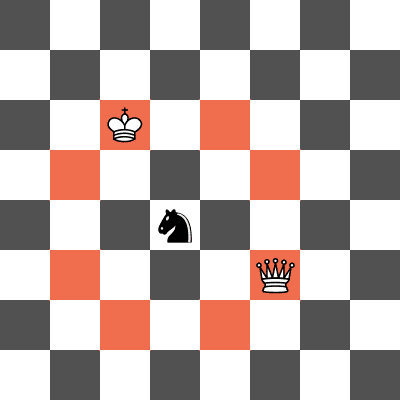
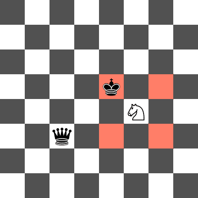

<h1 style='text-align: center;'> A. Forked!</h1>

<h5 style='text-align: center;'>time limit per test: 2 seconds</h5>
<h5 style='text-align: center;'>memory limit per test: 256 megabytes</h5>

Lunchbox is done with playing chess! His queen and king just got forked again!

In chess, a fork is when a knight attacks two pieces of higher value, commonly the king and the queen. Lunchbox knows that knights can be tricky, and in the version of chess that he is playing, knights are even trickier: instead of moving $1$ tile in one direction and $2$ tiles in the other, knights in Lunchbox's modified game move $a$ tiles in one direction and $b$ tiles in the other.

Lunchbox is playing chess on an infinite chessboard which contains all cells $(x,y)$ where $x$ and $y$ are (possibly negative) integers. Lunchbox's king and queen are placed on cells $(x_K,y_K)$ and $(x_Q,y_Q)$ respectively. Find the number of positions such that if a knight was placed on that cell, it would attack both the king and queen.

## Input

Each test contains multiple test cases. The first line contains an integer $t$ ($1 \leq t \leq 1000$) — the number of test cases. The description of the test cases follows.

The first line of each test case contains two integers $a$ and $b$ ($1 \le a, b \le 10^8$) — describing the possible moves of the knight.

The second line of each test case contains two integers $x_K$ and $y_K$ ($0 \le x_K, y_K \le 10^8$) — the position of Lunchbox's king. 

The third line in a test case contains $x_Q$ and $y_Q$ ($0 \le x_Q, y_Q \le 10^8$) — the position of Lunchbox's queen.

It is guaranteed that Lunchbox's queen and king will occupy different cells. That is, $(x_K,y_K) \neq (x_Q,y_Q)$.

## Output

For each test case, output the number of positions on an infinite chessboard such that a knight can attack both the king and the queen. 

## Example

## Input


```

42 10 03 31 13 11 34 40 08 04 21 43 4
```
## Output


```

2
1
2
0

```
## Note

In the first test case, the knight can move 2 squares in one direction and 1 square in the other (it is essentially the same as the knight in standard chess). A knight placed on $(2, 1)$ or $(1, 2)$ would attack both the king and queen. 

  ## Example

 of a knight placement that forks the queen and king in the first test case. The squares that the knight attacks are highlighted in red. In the second test case, a knight placed on $(2, 2)$ would attack both the king and queen.

  ## Example

 of a knight placement that does not fork the queen and king in the second test case. The knight attacks the king but not the queen. In the third test case, a knight placed on $(4, 4)$ or $(4, -4)$ would attack both the king and queen. 

In the fourth test case, there are no positions where the knight can attack both the king and the queen.

(Credits to EnDeRBeaT for the nice images)


#### tags 

#900 #brute_force #implementation 