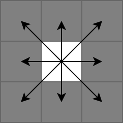
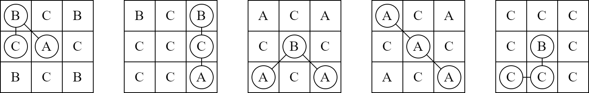

<h1 style='text-align: center;'> A. Easy As ABC</h1>

<h5 style='text-align: center;'>time limit per test: 1 second</h5>
<h5 style='text-align: center;'>memory limit per test: 1024 megabytes</h5>

You are playing a word puzzle. The puzzle starts with a $3$ by $3$ grid, where each cell contains either the letter A, B, or C.

The goal of this puzzle is to find the lexicographically smallest possible word of length $3$. The word can be formed by choosing three different cells where the cell containing the first letter is adjacent to the cell containing the second letter, and the cell containing the second letter is adjacent to the cell containing the third letter.

Two cells are adjacent to each other if they share a border or a corner, as shown in the following illustration. Formally, if $(r, c)$ denotes the cell in the $r$-th row and $c$-th column, then cell $(r, c)$ is adjacent to cell $(r, c + 1)$, $(r - 1, c + 1)$, $(r - 1, c)$, $(r - 1, c - 1)$, $(r, c - 1)$, $(r + 1, c - 1)$, $(r + 1, c)$, and $(r + 1, c + 1)$.

  Determine the lexicographically smallest possible word of length $3$ that you can find within the grid.

A string $s$ of length $n$ is lexicographically smaller than string $t$ of the same length if there exists an integer $1 \leq i \leq n$ such that $s_j = t_j$ for all $1 \leq j < i$, and $s_i < t_i$ in alphabetical order. The following illustration shows some examples on some grids and their the lexicographically smallest possible word of length $3$ that you can find within the grids.

  ## Input

## Input

 consists of three lines, each containing three letters, representing the puzzle grid. Each letter in the grid can only be either A, B, or C.

## Output

## Output

 the lexicographically smallest possible word of length $3$ that you can find within the grid.

## Examples

## Input


```

BCB
CAC
BCB

```
## Output


```

ABC

```
## Input


```

BCB
CCC
CCA

```
## Output


```

ACB

```
## Input


```

ACA
CBC
ACA

```
## Output


```

ABA

```
## Input


```

ACA
CAC
ACA

```
## Output


```

AAA

```
## Input


```

CCC
CBC
CCC

```
## Output


```

BCC

```


#### tags 

#1000 #brute_force 