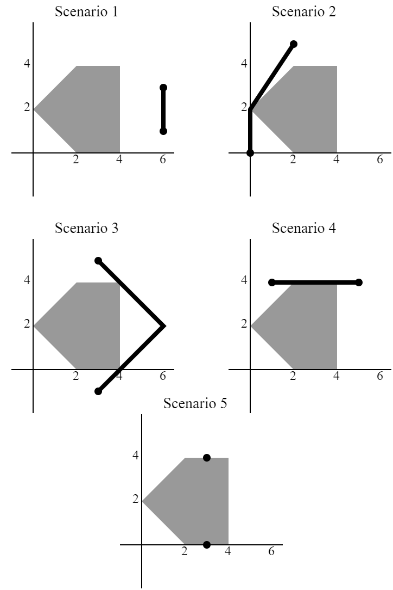

<h1 style='text-align: center;'> D. Spaceship Exploration</h1>

<h5 style='text-align: center;'>time limit per test: 3 seconds</h5>
<h5 style='text-align: center;'>memory limit per test: 1024 megabytes</h5>

In The ICPC Galaxy, there exists a zone filled with asteroids that is unsafe to enter. The map of the galaxy is represented in a 2D Cartesian coordinate system. The zone is in the shape of an $N$-sided convex polygon. Each corner is numbered from $1$ to $N$; corner $i$ is located at $(X_i, Y_i)$. At any moment, you should not be inside this polygon; however, it is safe to touch the side of the polygon.

There are $Q$ scenarios (numbered from $1$ to $Q$). In scenario $j$, you want to go from a starting point at $(A_j, B_j)$ to an ending point at $(C_j, D_j)$. You will be riding on a special spaceship that can only travel in a straight line. First, you set the direction of the spaceship, then the spaceship will start traveling in that direction. During the travel, you are only allowed to change direction at most once. Changing direction means you stop the spaceship, set a new direction, and then start traveling again in the new direction.

For each scenario, determine the minimum distance required to travel without being inside of the zone at any moment, or report if it is impossible to reach the ending point.

## Input

The first line consists of an integer $N$ ($3 \leq N \leq 100\,000$).

Each of the next $N$ lines consists of two integers $X_i$ $Y_i$ ($-10^9 \leq X_i, Y_i \leq 10^9$). The points form a convex polygon in counterclockwise order. There are no three points which are collinear.

The following line consists of an integer $Q$ ($1 \leq Q \leq 100\,000$).

Each of the next $Q$ lines consists of four integers $A_j$ $B_j$ $C_j$ $D_j$ ($-10^9 \leq A_j, B_j, C_j, D_j \leq 10^9$). There are no starting points and ending points inside the zone. However, it is possible for the starting point and the ending point to be at the side of the zone.

All the coordinates in the input are integers.

## Output

For each scenario, output the answer in a single line.

If it is possible to reach the ending point without being inside the zone at any moment, then output the minimum distance required to travel. Otherwise, output -1.

Your answer is considered correct if its absolute error or relative error does not exceed $10^{-6}$. Namely, if your answer is $a$ and the jury's answer is $b$, then your answer is accepted if $\frac{|a - b|}{\max(1, |b|)} \leq 10^{-6}$.

## Examples

## Input


```

5
0 2
2 0
4 0
4 4
2 4
5
6 1 6 3
2 5 0 0
3 5 3 -1
1 4 5 4
3 4 3 0

```
## Output


```

2
5.6055512755
8.48528137422
4
-1
```
## Input


```

4
-10 -9
10 -9
10 9
-10 9
2
0 10 0 -10
-10 -10 -10 -10

```
## Output


```

200.9975124224
0
```
## Input


```

8
-20 -10
10 -20
25 -15
35 -5
30 10
15 20
-25 15
-30 5
6
-15 -15 -15 20
-30 -5 30 15
25 20 -5 -20
-5 25 20 -20
-30 10 30 -10
-30 -50 50 0

```
## Output


```

59.0857761929
103.2455532034
94.7213595500
101.5640991922
164.8528137424
94.3398113206
```
## Note

Explanation for the sample input/output #1

This sample is depicted in the following illustration.

  During scenario $1$ and $4$, you can directly go to the ending point without changing the direction.

During scenario $2$, you can go to $(0, 2)$, then change direction to the ending point.

During scenario $3$, you can go to $(6, 2)$, then change direction to the ending point.

During scenario $5$, it can be shown that it is impossible to reach the ending point.


#### tags 

#2800 #binary_search #geometry 