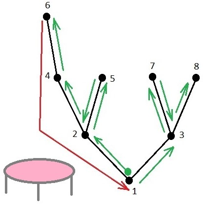

<h1 style='text-align: center;'> F. Caterpillar on a Tree</h1>

<h5 style='text-align: center;'>time limit per test: 2 seconds</h5>
<h5 style='text-align: center;'>memory limit per test: 256 megabytes</h5>

The caterpillar decided to visit every node of the tree. Initially, it is sitting at the root.

The tree is represented as a rooted tree with the root at the node $1$. Each crawl to a neighboring node takes $1$ minute for the caterpillar. 

And there is a trampoline under the tree. If the caterpillar detaches from the tree and falls onto the trampoline, it will end up at the root of the tree in $0$ seconds. But the trampoline is old and can withstand no more than $k$ caterpillar's falls.

What is the minimum time the caterpillar can take to visit all the nodes of the tree?

More formally, we need to find the minimum time required to visit all the nodes of the tree, if the caterpillar starts at the root (node $1$) and moves using two methods.

1. Crawl along an edge to one of the neighboring nodes: takes $1$ minute.
2. Teleport to the root: takes no time, no new nodes become visited.

The second method (teleportation) can be used at most $k$ times. The caterpillar can finish the journey at any node.

## Input

The first line of the input contains two integers: $n$ ($2 \le n \le 2\cdot 10^5$) — the number of nodes in the tree, and $k$ ($0 \le k \le 10^9$) — the maximum number of teleports to the root.

The second line contains $n-1$ integers $p_2$, $p_3$, ..., $p_n$ ($1 \le p_i \le n$) — the ancestors in the tree for nodes $2, 3, \ldots, n$; node $1$ is the root.

## Output

Print a single number in a single line — the minimum number of minutes required to visit all the nodes of the tree.

## Examples

## Input


```

8 1
1 1 2 2 4 3 3

```
## Output


```

9

```
## Input


```

4 0
4 4 1

```
## Output


```

4

```
## Note

The figure shows one of the ways to traverse the tree from the first test in 9 minutes. 

  

#### tags 

#2500 #dfs_and_similar #graphs #greedy #implementation #sortings #trees 