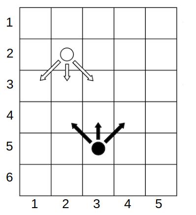

<h1 style='text-align: center;'> E. Eat the Chip</h1>

<h5 style='text-align: center;'>time limit per test: 1 second</h5>
<h5 style='text-align: center;'>memory limit per test: 256 megabytes</h5>

Alice and Bob are playing a game on a checkered board. The board has $h$ rows, numbered from top to bottom, and $w$ columns, numbered from left to right. Both players have a chip each. Initially, Alice's chip is located at the cell with coordinates $(x_a, y_a)$ (row $x_a$, column $y_a$), and Bob's chip is located at $(x_b, y_b)$. It is guaranteed that the initial positions of the chips do not coincide. Players take turns making moves, with Alice starting.

On her turn, Alice can move her chip one cell down or one cell down-right or down-left (diagonally). Bob, on the other hand, moves his chip one cell up, up-right, or up-left. It is not allowed to make moves that go beyond the board boundaries.

More formally, if at the beginning of Alice's turn she is in the cell with coordinates $(x_a, y_a)$, then she can move her chip to one of the cells $(x_a + 1, y_a)$, $(x_a + 1, y_a - 1)$, or $(x_a + 1, y_a + 1)$. Bob, on his turn, from the cell $(x_b, y_b)$ can move to $(x_b - 1, y_b)$, $(x_b - 1, y_b - 1)$, or $(x_b - 1, y_b + 1)$. The new chip coordinates $(x', y')$ must satisfy the conditions $1 \le x' \le h$ and $1 \le y' \le w$.

  ## Example

 game state. Alice plays with the white chip, Bob with the black one. Arrows indicate possible moves. A player immediately wins if they place their chip in a cell occupied by the other player's chip. If either player cannot make a move (Alice—if she is in the last row, i.e. $x_a = h$, Bob—if he is in the first row, i.e. $x_b = 1$), the game immediately ends in a draw.

What will be the outcome of the game if both opponents play optimally?

## Input

Each test consists of multiple test cases. The first line contains a single integer $t$ ($1 \le t \le 10^4$) — the number of test cases. This is followed by the description of the test cases.

Each test case consists of a single line containing six integers $h$, $w$, $x_a$, $y_a$, $x_b$, $y_b$ ($1 \le x_a, x_b \le h \le 10^6$, $1 \le y_a, y_b \le w \le 10^9$) — the dimensions of the board and the initial positions of Alice's and Bob's chips. It is guaranteed that either $x_a \ne x_b$ or $y_a \ne y_b$.

It is guaranteed that the sum of $h$ over all test cases does not exceed $10^6$.

## Output

For each test case, output "Alice" if Alice wins, "Bob" if Bob wins, and "Draw" if neither player can secure a victory. You can output each letter in any case (lowercase or uppercase). For example, the strings "bOb", "bob", "Bob", and "BOB" will be accepted as Bob's victory.

## Example

## Input


```

126 5 2 2 5 34 1 2 1 4 11 4 1 3 1 15 5 1 4 5 24 4 1 1 4 410 10 1 6 10 810 10 2 6 10 710 10 9 1 8 110 10 8 1 10 210 10 1 1 2 110 10 1 3 4 110 10 3 1 1 1
```
## Output


```

Alice
Bob
Draw
Draw
Draw
Alice
Draw
Draw
Bob
Alice
Alice
Draw

```


#### tags 

#1600 #brute_force #games #greedy #math 