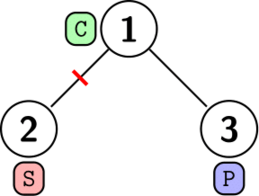

<h1 style='text-align: center;'> G. Vlad and Trouble at MIT</h1>

<h5 style='text-align: center;'>time limit per test: 1 second</h5>
<h5 style='text-align: center;'>memory limit per test: 256 megabytes</h5>

Vladislav has a son who really wanted to go to MIT. The college dormitory at MIT (Moldova Institute of Technology) can be represented as a tree with $n$ vertices, each vertex being a room with exactly one student. A tree is a connected undirected graph with $n$ vertices and $n-1$ edges.

Tonight, there are three types of students: 

* students who want to party and play music (marked with $\texttt{P}$),
* students who wish to sleep and enjoy silence (marked with $\texttt{S}$), and
* students who don't care (marked with $\texttt{C}$).

Initially, all the edges are thin walls which allow music to pass through, so when a partying student puts music on, it will be heard in every room. However, we can place some thick walls on any edges — thick walls don't allow music to pass through them.

The university wants to install some thick walls so that every partying student can play music, and no sleepy student can hear it.

Because the university lost a lot of money in a naming rights lawsuit, they ask you to find the minimum number of thick walls they will need to use.

## Input

The first line contains a single integer $t$ ($1 \leq t \leq 1000$) — the number of test cases.

The first line of each test case contains an integer $n$ ($2 \leq n \leq 10^5$) — the number of vertices in the tree.

The second line of each test case contains $n-1$ integers $a_2, \dots , a_n$ ($1 \leq a_i < i$) — it means there is an edge between $i$ and $a_i$ in the tree.

The third line of each test case contains a string $s$ of length $n$ consisting of characters $\texttt{P}$, $\texttt{S}$, and $\texttt{C}$, denoting that student $i$ is of type $s_i$.

The sum of $n$ over all test cases does not exceed $10^5$.

## Output

For each test case, output a single integer — the minimum number of thick walls needed.

## Example

## Input


```

331 1CSP41 2 2PCSS41 2 2PPSS
```
## Output


```

1
1
2

```
## Note

In the first case, we can install one thick wall between rooms $1$ and $2$, as shown below. We cannot install $0$ walls, since then the music from room 3 will reach room 2 where a student wants to sleep, so the answer is $1$. There are other valid solutions. 

  

#### tags 

#1900 #dfs_and_similar #dp #flows #graphs #greedy #implementation #trees 