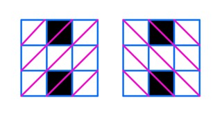
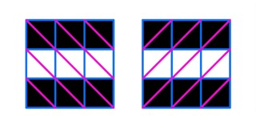

<h1 style='text-align: center;'> B. Sasha and the Drawing</h1>

<h5 style='text-align: center;'>time limit per test: 1 second</h5>
<h5 style='text-align: center;'>memory limit per test: 256 megabytes</h5>

Even in kindergarten, Sasha liked a girl. Therefore, he wanted to give her a drawing and attract her attention.

As a drawing, he decided to draw a square grid of size $n \times n$, in which some cells are colored. But coloring the cells is difficult, so he wants to color as few cells as possible. But at the same time, he wants at least $k$ diagonals to have at least one colored cell. ## Note

 that the square grid of size $n \times n$ has a total of $4n - 2$ diagonals.

Help little Sasha to make the girl fall in love with him and tell him the minimum number of cells he needs to color.

## Input

Each test consists of multiple test cases. The first line contains a single integer $t$ ($1 \le t \le 1000$) — the number of test cases. The description of the test cases follows.

The only line of each test case contains two integers $n$ and $k$ ($2 \leq n \leq 10^8$, $1 \leq k \leq 4n - 2$) — the size of the square grid and the minimum number of diagonals in which there should be at least one colored cell.

## Output

For each test case, output a single integer — the minimum number of cells that need to be colored.

## Example

## Input


```

73 43 33 103 94 77 112 3
```
## Output


```

2
2
6
5
4
6
2

```
## Note

In the pictures below, the colored cells are marked in black, and all diagonals are marked in purple.

In the first test case, you can color $2$ cells so that $4$ diagonals contain at least one colored cell:

  In the third test case, you can color $6$ cells so that all $10$ diagonals contain at least one colored cell:

  

#### tags 

#800 #constructive_algorithms #greedy #math 