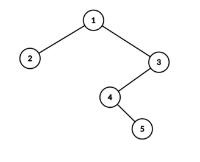

<h1 style='text-align: center;'> F. Sasha and the Wedding Binary Search Tree</h1>

<h5 style='text-align: center;'>time limit per test: 2 seconds</h5>
<h5 style='text-align: center;'>memory limit per test: 256 megabytes</h5>

Having overcome all the difficulties and hardships, Sasha finally decided to marry his girlfriend. To do this, he needs to give her an engagement ring. However, his girlfriend does not like such romantic gestures, but she does like binary search trees$^{\dagger}$. So Sasha decided to give her such a tree.

After spending a lot of time on wedding websites for programmers, he found the perfect binary search tree with the root at vertex $1$. In this tree, the value at vertex $v$ is equal to $val_v$.

But after some time, he forgot the values in some vertices. Trying to remember the found tree, Sasha wondered — how many binary search trees could he have found on the website, if it is known that the values in all vertices are integers in the segment $[1, C]$. Since this number can be very large, output it modulo $998\,244\,353$.

$^{\dagger}$A binary search tree is a rooted binary tree in which for any vertex $x$, the following property holds: the values of all vertices in the left subtree of vertex $x$ (if it exists) are less than or equal to the value at vertex $x$, and the values of all vertices in the right subtree of vertex $x$ (if it exists) are greater than or equal to the value at vertex $x$.

## Input

Each test consists of multiple test cases. The first line contains a single integer $t$ ($1 \le t \le 10^5$) — the number of test cases. The description of the test cases follows.

The first line of each test case contains two integers $n$ and $C$ ($2 \leq n \leq 5 \cdot 10^5$, $1 \leq C \leq 10^9$) — the number of vertices in the tree and the maximum allowed value at the vertex.

The next $n$ lines describe the vertices of the tree. The $i$-th line contains three integers $L_i, R_i$ and $val_i$ ($-1 \le L_i, R_i \le n$, $-1 \le val_i \le C$, $L_i, R_i, val_i \ne 0$) — the number of the left child, the number of the right child, and the value at the $i$-th vertex, respectively. If $L_i = -1$, then the $i$-th vertex has no left son. If $R_i = -1$, then the $i$-th vertex has no right son. If $val_i = -1$, then the value at the $i$-th vertex is unknown.

It is guaranteed that at least one suitable binary search tree exists.

It is guaranteed that the sum of $n$ over all test cases does not exceed $5 \cdot 10^5$.

## Output

For each test case, output a single integer — the number of suitable binary search trees modulo $998\,244\,353$.

## Example

## Input


```

35 52 3 -1-1 -1 24 -1 3-1 5 -1-1 -1 -13 692 3 47-1 -1 13-1 -1 693 32 3 -1-1 -1 -1-1 -1 -1
```
## Output


```

4
1
10

```
## Note

In the first test case, the binary search tree has the following form:

  Then the possible values at the vertices are: $[2, 2, 3, 2, 2]$, $[2, 2, 3, 2, 3]$, $[2, 2, 3, 3, 3]$, and $[3, 2, 3, 3, 3]$.

In the second test case, the values at all vertices are known, so there is only one suitable binary search tree.


#### tags 

#2300 #brute_force #combinatorics #data_structures #dfs_and_similar #math #trees 