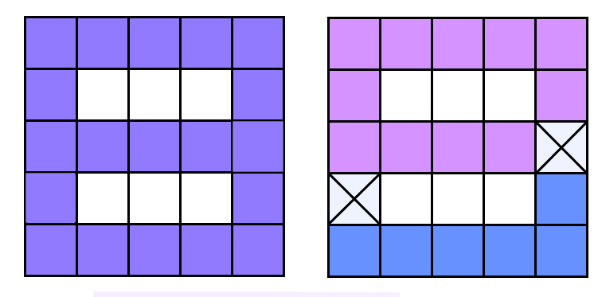

<h1 style='text-align: center;'> A. Cutting Figure</h1>

<h5 style='text-align: center;'>time limit per test: 2 seconds</h5>
<h5 style='text-align: center;'>memory limit per test: 256 megabytes</h5>

You've gotten an *n* × *m* sheet of squared paper. Some of its squares are painted. Let's mark the set of all painted squares as *A*. Set *A* is connected. Your task is to find the minimum number of squares that we can delete from set *A* to make it not connected.

A set of painted squares is called connected, if for every two squares *a* and *b* from this set there is a sequence of squares from the set, beginning in *a* and ending in *b*, such that in this sequence any square, except for the last one, shares a common side with the square that follows next in the sequence. An empty set and a set consisting of exactly one square are connected by definition.

## Input

The first input line contains two space-separated integers *n* and *m* (1 ≤ *n*, *m* ≤ 50) — the sizes of the sheet of paper. 

Each of the next *n* lines contains *m* characters — the description of the sheet of paper: the *j*-th character of the *i*-th line equals either "#", if the corresponding square is painted (belongs to set *A*), or equals "." if the corresponding square is not painted (does not belong to set *A*). It is guaranteed that the set of all painted squares *A* is connected and isn't empty.

## Output

On the first line print the minimum number of squares that need to be deleted to make set *A* not connected. If it is impossible, print -1. 

## Examples

## Input


```
5 4  
####  
#..#  
#..#  
#..#  
####  

```
## Output


```
2  

```
## Input


```
5 5  
#####  
#...#  
#####  
#...#  
#####  

```
## Output


```
2  

```
## Note

In the first sample you can delete any two squares that do not share a side. After that the set of painted squares is not connected anymore.

The note to the second sample is shown on the figure below. To the left there is a picture of the initial set of squares. To the right there is a set with deleted squares. The deleted squares are marked with crosses. 

  

#### tags 

#1700 #constructive_algorithms #graphs #trees 