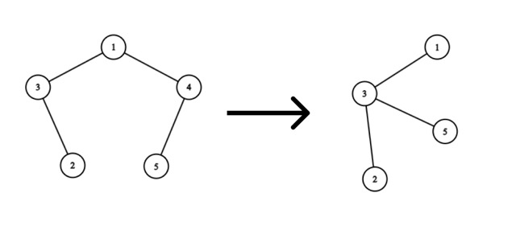
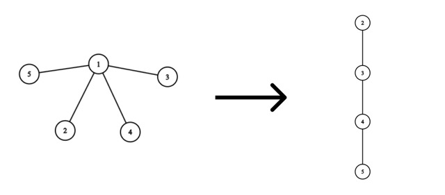
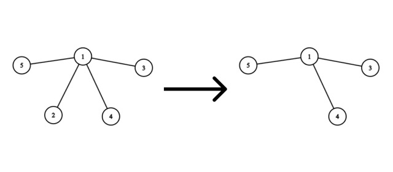

<h1 style='text-align: center;'> F. Andrey's Tree</h1>

<h5 style='text-align: center;'>time limit per test: 4 seconds</h5>
<h5 style='text-align: center;'>memory limit per test: 256 megabytes</h5>

Master Andrey loves trees$^{\dagger}$ very much, so he has a tree consisting of $n$ vertices.

But it's not that simple. Master Timofey decided to steal one vertex from the tree. If Timofey stole vertex $v$ from the tree, then vertex $v$ and all edges with one end at vertex $v$ are removed from the tree, while the numbers of other vertices remain unchanged. To prevent Andrey from getting upset, Timofey decided to make the resulting graph a tree again. To do this, he can add edges between any vertices $a$ and $b$, but when adding such an edge, he must pay $|a - b|$ coins to the Master's Assistance Center.

## Note

 that the resulting tree does not contain vertex $v$.

Timofey has not yet decided which vertex $v$ he will remove from the tree, so he wants to know for each vertex $1 \leq v \leq n$, the minimum number of coins needed to be spent to make the graph a tree again after removing vertex $v$, as well as which edges need to be added.

$^{\dagger}$A tree is an undirected connected graph without cycles.

## Input

Each test consists of multiple test cases. The first line contains a single integer $t$ ($1 \le t \le 10^4$) — the number of test cases. The description of the test cases follows.

The first line of each test case contains a single integer $n$ ($5 \le n \le 2\cdot10^5$) — the number of vertices in Andrey's tree.

The next $n - 1$ lines contain a description of the tree's edges. The $i$-th of these lines contains two integers $u_i$ and $v_i$ ($1 \le u_i, v_i \le n$) — the numbers of vertices connected by the $i$-th edge.

It is guaranteed that the given edges form a tree.

It is guaranteed that the sum of $n$ over all test cases does not exceed $2\cdot10^5$.

## Output

For each test case, output the answer in the following format:

For each vertex $v$ (in the order from $1$ to $n$), in the first line output two integers $w$ and $m$ — the minimum number of coins that need to be spent to make the graph a tree again after removing vertex $v$, and the number of added edges.

Then output $m$ lines, each containing two integers $a$ and $b$ ($1 \le a, b \le n, a \ne v, b \ne v$, $a \ne b$) — the ends of the added edge.

If there are multiple ways to add edges, you can output any solution with the minimum cost.

## Example

## Input


```

351 31 44 53 254 24 33 55 152 11 51 41 3
```
## Output


```

1 1
3 4

0 0

1 1
1 2

2 1
3 5

0 0

0 0

0 0

1 1
1 2

1 1
1 2

1 1
1 2

3 3
2 3
4 5
3 4

0 0

0 0

0 0

0 0


```
## Note

In the first test case:

Consider the removal of vertex $4$:

  The optimal solution would be to add an edge from vertex $5$ to vertex $3$. Then we will spend $|5 - 3| = 2$ coins.

In the third test case:

Consider the removal of vertex $1$:

  The optimal solution would be: 

* Add an edge from vertex $2$ to vertex $3$, spending $|2 - 3| = 1$ coin.
* Add an edge from vertex $3$ to vertex $4$, spending $|3 - 4| = 1$ coin.
* Add an edge from vertex $4$ to vertex $5$, spending $|4 - 5| = 1$ coin.

Then we will spend a total of $1 + 1 + 1 = 3$ coins.

Consider the removal of vertex $2$:

  No edges need to be added, as the graph will remain a tree after removing the vertex.


#### tags 

#2800 #binary_search #constructive_algorithms #data_structures #dfs_and_similar #dsu #greedy #implementation #trees 