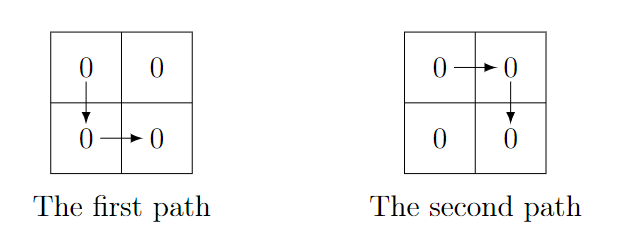
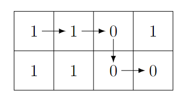

<h1 style='text-align: center;'> B. Binary Path</h1>

<h5 style='text-align: center;'>time limit per test: 1 second</h5>
<h5 style='text-align: center;'>memory limit per test: 256 megabytes</h5>

You are given a $2 \times n$ grid filled with zeros and ones. Let the number at the intersection of the $i$-th row and the $j$-th column be $a_{ij}$.

There is a grasshopper at the top-left cell $(1, 1)$ that can only jump one cell right or downwards. It wants to reach the bottom-right cell $(2, n)$. Consider the binary string of length $n+1$ consisting of numbers written in cells of the path without changing their order.

Your goal is to: 

1. Find the lexicographically smallest$^\dagger$ string you can attain by choosing any available path;
2. Find the number of paths that yield this lexicographically smallest string.

$^\dagger$ If two strings $s$ and $t$ have the same length, then $s$ is lexicographically smaller than $t$ if and only if in the first position where $s$ and $t$ differ, the string $s$ has a smaller element than the corresponding element in $t$.

## Input

Each test contains multiple test cases. The first line contains the number of test cases $t$ ($1 \le t \le 10^4$). The description of the test cases follows.

The first line of each test case contains a single integer $n$ ($2 \le n \le 2 \cdot 10^5$).

The second line of each test case contains a binary string $a_{11} a_{12} \ldots a_{1n}$ ($a_{1i}$ is either $0$ or $1$).

The third line of each test case contains a binary string $a_{21} a_{22} \ldots a_{2n}$ ($a_{2i}$ is either $0$ or $1$).

It is guaranteed that the sum of $n$ over all test cases does not exceed $2 \cdot 10^5$.

## Output

For each test case, output two lines: 

1. The lexicographically smallest string you can attain by choosing any available path;
2. The number of paths that yield this string.
## Example

## Input


```

32000041101110080010011111101101
```
## Output


```

000
2
11000
1
001001101
4

```
## Note

In the first test case, the lexicographically smallest string is $\mathtt{000}$. There are two paths that yield this string:

  In the second test case, the lexicographically smallest string is $\mathtt{11000}$. There is only one path that yields this string:

  

#### tags 

#1300 #dp #greedy #implementation 