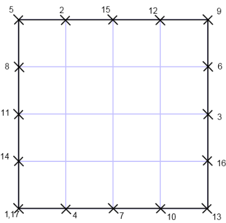

<h1 style='text-align: center;'> B. Square</h1>

<h5 style='text-align: center;'>time limit per test: 2 seconds</h5>
<h5 style='text-align: center;'>memory limit per test: 256 megabytes</h5>

There is a square painted on a piece of paper, the square's side equals *n* meters. John Doe draws crosses on the square's perimeter. John paints the first cross in the lower left corner of the square. Then John moves along the square's perimeter in the clockwise direction (first upwards, then to the right, then downwards, then to the left and so on). Every time he walks (*n* + 1) meters, he draws a cross (see picture for clarifications).

John Doe stops only when the lower left corner of the square has two crosses. How many crosses will John draw?

   The figure shows the order in which John draws crosses for a square with side 4. The lower left square has two crosses. Overall John paints 17 crosses.  ## Input

The first line contains integer *t* (1 ≤ *t* ≤ 104) — the number of test cases. 

The second line contains *t* space-separated integers *n**i* (1 ≤ *n**i* ≤ 109) — the sides of the square for each test sample.

## Output

For each test sample print on a single line the answer to it, that is, the number of crosses John will draw as he will move along the square of the corresponding size. Print the answers to the samples in the order in which the samples are given in the input.

Please do not use the %lld specifier to read or write 64-bit integers in С++. It is preferred to use the cin, cout streams or the %I64d specifier. 

## Examples

## Input


```
3  
4 8 100  

```
## Output


```
17  
33  
401  

```


#### tags 

#1200 #math 