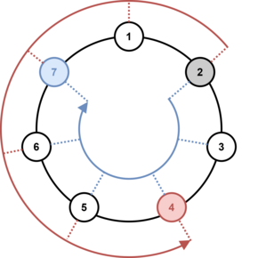
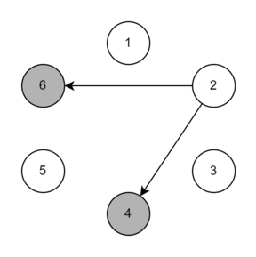
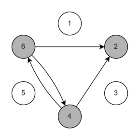
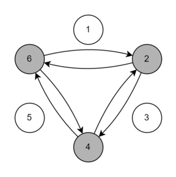

<h1 style='text-align: center;'> D. Rudolf and the Ball Game</h1>

<h5 style='text-align: center;'>time limit per test: 2 seconds</h5>
<h5 style='text-align: center;'>memory limit per test: 256 megabytes</h5>

Rudolf and Bernard decided to play a game with their friends. $n$ people stand in a circle and start throwing a ball to each other. They are numbered from $1$ to $n$ in the clockwise order.

Let's call a transition a movement of the ball from one player to his neighbor. The transition can be made clockwise or counterclockwise.

Let's call the clockwise (counterclockwise) distance from player $y_1$ to player $y_2$ the number of transitions clockwise (counterclockwise) that need to be made to move from player $y_1$ to player $y_2$. For example, if $n=7$ then the clockwise distance from $2$ to $5$ is $3$, and the counterclockwise distance from $2$ to $5$ is $4$.

Initially, the ball is with the player number $x$ (players are numbered clockwise). On the $i$-th move the person with the ball throws it at a distance of $r_i$ ($1 \le r_i \le n - 1$) clockwise or counterclockwise. For example, if there are $7$ players, and the $2$nd player, after receiving the ball, throws it a distance of $5$, then the ball will be caught by either the $7$th player (throwing clockwise) or the $4$th player (throwing counterclockwise). An illustration of this example is shown below.

  The game was interrupted after $m$ throws due to unexpected rain. When the rain stopped, the guys gathered again to continue. However, no one could remember who had the ball. As it turned out, Bernard remembered the distances for each of the throws and the direction for some of the throws (clockwise or counterclockwise).

Rudolf asks you to help him and based on the information from Bernard, calculate the numbers of the players who could have the ball after $m$ throws.

## Input

The first line of the input contains a single integer $t$ ($1 \le t \le 10^4$) — the number of test cases. Then follow the descriptions of the test cases.

The first line of each test case contains three integers $n, m, x$ ($2 \le n \le 1000$, $1 \le m \le 1000$, $1 \le x \le n$) — the number of players, the number of throws made, and the number of the player who threw the ball first, respectively.

The next $m$ lines contain information about each throw in order. Each of them contains an integer $r_i$ ($1 \le r_i \le n - 1$) — the distance at which the $i$-th throw was made, and a symbol $c_i$, equal to '0', '1', or '?':

* if $c_i$='0', then the $i$-th throw was made clockwise,
* if $c_i$='1', then the $i$-th throw was made counterclockwise,
* if $c_i$='?', then Bernard does not remember the direction and the $i$-th throw could have been made either clockwise or counterclockwise.

It is guaranteed that the sum $n \cdot m$ ($n$ multiplied by $m$) over all test cases does not exceed $2 \cdot 10^5$.

## Output

For each test case, output two lines.

In the first line, output the number of players $k$ ($1 \le k \le n$) who could have the ball at the end of the game.

In the next line, output $k$ numbers $b_i$ ($1 \le b_i \le n$) — the numbers of the players in increasing order. All numbers must be different.

## Example

## Input


```

56 3 22 ?2 ?2 ?12 1 23 110 7 42 ?9 14 ?7 02 08 15 ?5 3 14 04 ?1 ?4 1 12 ?
```
## Output


```

3
2 4 6 
1
11 
4
3 5 7 9 
3
2 3 5 
1
3 

```
## Note

Below is an illustration of three throws for the first test case. The arrows denote possible throw directions. Players who could have the ball after the throw are highlighted in gray.

    

#### tags 

#1200 #dfs_and_similar #dp #implementation 