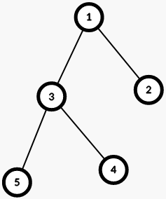
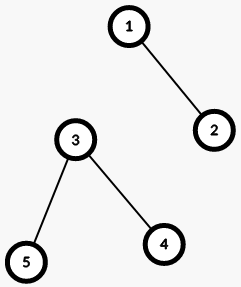

<h1 style='text-align: center;'> C. Tree Cutting</h1>

<h5 style='text-align: center;'>time limit per test: 3 seconds</h5>
<h5 style='text-align: center;'>memory limit per test: 512 megabytes</h5>

You are given a tree with $n$ vertices.

Your task is to find the maximum number $x$ such that it is possible to remove exactly $k$ edges from this tree in such a way that the size of each remaining connected component$^{\dagger}$ is at least $x$.

$^{\dagger}$ Two vertices $v$ and $u$ are in the same connected component if there exists a sequence of numbers $t_1, t_2, \ldots, t_k$ of arbitrary length $k$, such that $t_1 = v$, $t_k = u$, and for each $i$ from $1$ to $k - 1$, vertices $t_i$ and $t_{i+1}$ are connected by an edge.

## Input

Each test consists of several sets of input data. The first line contains a single integer $t$ ($1 \le t \le 10^4$) — the number of sets of input data. This is followed by a description of the sets of input data.

The first line of each set of input data contains two integers $n$ and $k$ ($1 \le k < n \le 10^5$) — the number of vertices in the tree and the number of edges to be removed.

Each of the next $n - 1$ lines of each set of input data contains two integers $v$ and $u$ ($1 \le v, u \le n$) — the next edge of the tree.

It is guaranteed that the sum of the values of $n$ for all sets of input data does not exceed $10^5$.

## Output

For each set of input data, output a single line containing the maximum number $x$ such that it is possible to remove exactly $k$ edges from the tree in such a way that the size of each remaining connected component is at least $x$.

## Example

## Input


```

65 11 21 33 43 52 11 26 11 22 33 44 55 63 11 21 38 21 21 32 42 53 63 73 86 21 22 31 44 55 6
```
## Output


```

2
1
3
1
1
2

```
## Note

The tree in the first set of input data:

  After removing the edge $1$ — $3$, the tree will look as follows:

  The tree has split into two connected components. The first component consists of two vertices: $1$ and $2$. The second connected component consists of three vertices: $3, 4$ and $5$. In both connected components, there are at least two vertices. It can be shown that the answer $3$ is not achievable, so the answer is $2$.


#### tags 

#1600 #binary_search #dp #greedy #implementation #trees 