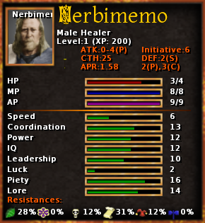

<h1 style='text-align: center;'> E. Damage per Second</h1>

<h5 style='text-align: center;'>time limit per test: 5 seconds</h5>
<h5 style='text-align: center;'>memory limit per test: 1024 megabytes</h5>

You just created a new character in your favourite role-playing game and now have to decide how to skill him.

  The two skill attributes to be chosen are: damage per hit and hits per second. Damage per hit is the amount of damage you deal with a single hit, while hits per second is the number of hits you can make in one second. Initially, both skill attributes are set at $0$. You have $k$ skill points to distribute as you want; in other words, you can choose the values of the two skills so that they are positive integers with sum at most $k$. 

The tutorial of the game (the boring part you want to finish as soon as possible) consists of $n$ monsters to be killed one after the other. The $i$-th monster has $h_i$ health points, i.e., it dies after you have inflicted at least $h_i$ damage.

How can you assign the two skill attributes to minimize the time necessary to kill all the $n$ monsters?

## Input

The first line contains two integers $n$ and $k$ ($1\leq n\leq200\,000$, $2\leq k\leq200\,000$) — the number of enemies and the number of skill points.

The second line contains $n$ integers $h_i$ ($1\leq h_i\leq10^{13}$) — the health of the $i$th enemy.

## Output

Print two positive integers $x$ and $y$ ($1\le x, y$ and $x+y\le k$) — the number of skill points you want to invest in damage per hit and hits per second. If there are multiple optimal solutions, print any of them.

## Examples

## Input


```

1 714
```
## Output


```

3 4

```
## Input


```

4 91 2 3 4
```
## Output


```

4 5

```
## Input


```

5 133 4 5 6 7
```
## Output


```

7 6

```
## Note

In the first sample, there is only one monster and you have $7$ skill points to distribute. If you make $3$ damage per hit, you will need $5$ hits to kill it. If you do $4$ hits per second, you will need $1.25$ seconds to beat the monster. There is no way to beat the monster faster than this.

In the second sample, you will need one hit for each monster and a total time of $0.8$ seconds if you distribute $4$ skill points on damage per hit and the remaining $5$ points on hits per second.


#### tags 

#2900 #brute_force #math 