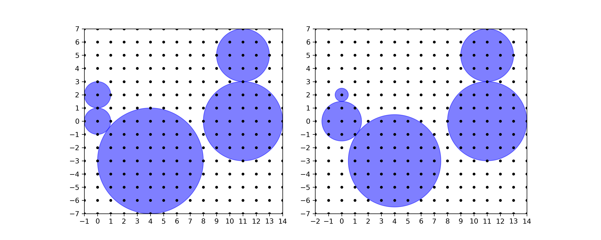
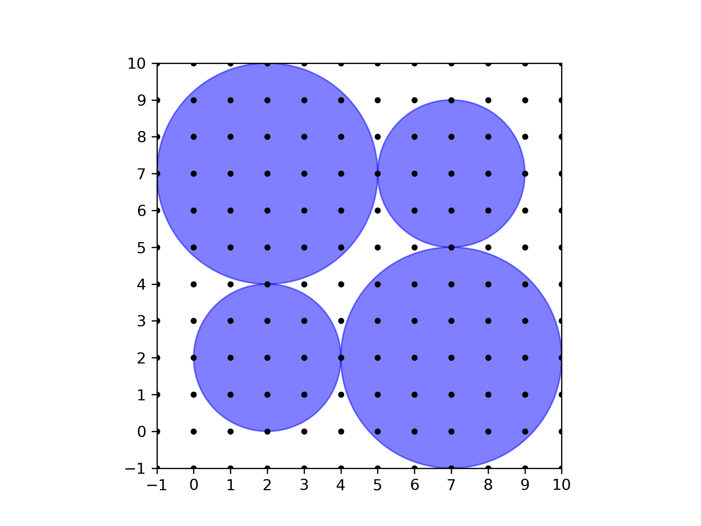

<h1 style='text-align: center;'> I. Disks</h1>

<h5 style='text-align: center;'>time limit per test: 2 seconds</h5>
<h5 style='text-align: center;'>memory limit per test: 256 megabytes</h5>

You are given $n$ disks in the plane. The center of each disk has integer coordinates, and the radius of each disk is a positive integer. No two disks overlap in a region of positive area, but it is possible for disks to be tangent to each other.

Your task is to determine whether it is possible to change the radii of the disks in such a way that: 

* Disks that were tangent to each other remain tangent to each other.
* No two disks overlap in a region of positive area.
* The sum of all radii strictly decreases.

 The new radii are allowed to be arbitrary positive real numbers. The centers of the disks cannot be changed.## Input

The first line contains an integer $n$ ($1\le n \le 1000$) — the number of disks.

The next $n$ lines contain three integers each. The $i$-th of such lines contains $x_i$, $y_i$ ($-10^9 \leq x_i, y_i \leq 10^9$), and $r_i$ ($1 \leq r_i \leq 10^9$) — the coordinates of the center, and the radius, of the $i$-th disk.

## Output

Print $\texttt{YES}$ if it is possible to change the radii in the desired manner. Otherwise, print $\texttt{NO}$.

## Examples

## Input


```

50 2 10 0 14 -3 411 0 311 5 2
```
## Output


```

YES

```
## Input


```

42 2 27 2 37 7 22 7 3
```
## Output


```

NO

```
## Note

In the first sample, one can decrease the radii of the first and third disk by $0.5$, and increase the radius of the second disk by $0.5$. This way, the sum of all radii decreases by $0.5$. The situation before and after changing the radii is depicted below.

  First sample (left) and a valid way to change the radii of the disks (right). In the second sample, depicted below, there is no way to change the radii of the disks in the desired manner.

  Second sample. 

#### tags 

#1800 #dfs_and_similar #geometry #graph_matchings #graphs 