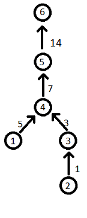

<h1 style='text-align: center;'> E. Building Forest</h1>

<h5 style='text-align: center;'>time limit per test: 2 seconds</h5>
<h5 style='text-align: center;'>memory limit per test: 256 megabytes</h5>

An oriented weighted forest is an acyclic weighted digraph in which from each vertex at most one edge goes.

The root of vertex *v* of an oriented weighted forest is a vertex from which no edge goes and which can be reached from vertex *v* moving along the edges of the weighted oriented forest. We denote the root of vertex *v* as *root*(*v*).

The depth of vertex *v* is the sum of weights of paths passing from the vertex *v* to its root. Let's denote the depth of the vertex *v* as *depth*(*v*).

Let's consider the process of constructing a weighted directed forest. Initially, the forest does not contain vertices. Vertices are added sequentially one by one. Overall, there are *n* performed operations of adding. The *i*-th (*i* > 0) adding operation is described by a set of numbers (*k*,  *v*1,  *x*1,  *v*2,  *x*2,  ... ,  *v**k*,  *x**k*) and means that we should add vertex number *i* and *k* edges to the graph: an edge from vertex *root*(*v*1) to vertex *i* with weight *depth*(*v*1) + *x*1, an edge from vertex *root*(*v*2) to vertex *i* with weight *depth*(*v*2) + *x*2 and so on. If *k* = 0, then only vertex *i* is added to the graph, there are no added edges.

Your task is like this: given the operations of adding vertices, calculate the sum of the weights of all edges of the forest, resulting after the application of all defined operations, modulo 1000000007 (109 + 7).

## Input

The first line contains a single integer *n* (1 ≤ *n* ≤ 105) — the number of operations of adding a vertex.

Next *n* lines contain descriptions of the operations, the *i*-th line contains the description of the operation of adding the *i*-th vertex in the following format: the first number of a line is an integer *k* (0 ≤ *k* ≤ *i* - 1), then follow 2*k* space-separated integers: *v*1, *x*1, *v*2, *x*2, ... , *v**k*, *x**k* (1 ≤ *v**j* ≤ *i* - 1, |*x**j*| ≤ 109). 

The operations are given in the order, in which they should be applied to the graph. It is guaranteed that sum *k* of all operations does not exceed 105, also that applying operations of adding vertexes does not result in loops and multiple edges. 

## Output

Print a single number — the sum of weights of all edges of the resulting graph modulo 1000000007 (109 + 7).

## Examples

## Input


```
6  
0  
0  
1 2 1  
2 1 5 2 2  
1 1 2  
1 3 4  

```
## Output


```
30  

```
## Input


```
5  
0  
1 1 5  
0  
0  
2 3 1 4 3  

```
## Output


```
9  

```
## Note

Conside the first sample:

1. Vertex 1 is added. *k* = 0, thus no edges are added.
2. Vertex 2 is added. *k* = 0, thus no edges are added.
3. Vertex 3 is added. *k* = 1. *v*1 = 2, *x*1 = 1. Edge from vertex *root*(2) = 2 to vertex 3 with weight *depth*(2) + *x*1 = 0 + 1 = 1 is added.
4. Vertex 4 is added. *k* = 2. *v*1 = 1, *x*1 = 5. Edge from vertex *root*(1) = 1 to vertex 4 with weight *depth*(1) + *x*1 = 0 + 5 = 5 is added. *v*2 = 2, *x*2 = 2. Edge from vertex *root*(2) = 3 to vertex 4 with weight *depth*(2) + *x*1 = 1 + 2 = 3 is added.
5. Vertex 5 is added. *k* = 1. *v*1 = 1, *x*1 = 2. Edge from vertex *root*(1) = 4 to vertex 5 with weight *depth*(1) + *x*1 = 5 + 2 = 7 is added.
6. Vertex 6 is added. *k* = 1. *v*1 = 3, *x*1 = 4. Edge from vertex *root*(3) = 5 to vertex 6 with weight *depth*(3) + *x*1 = 10 + 4 = 14 is added.

The resulting graph is shown on the pictore below: 


#### tags 

#2000 #data_structures #dsu #graphs 