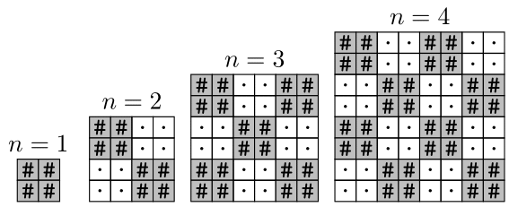

<h1 style='text-align: center;'> B. Upscaling</h1>

<h5 style='text-align: center;'>time limit per test: 1 second</h5>
<h5 style='text-align: center;'>memory limit per test: 256 megabytes</h5>

You are given an integer $n$. ## Output

 a $2n \times 2n$ checkerboard made of $2 \times 2$ squares alternating '$\texttt{#}$' and '$\texttt{.}$', with the top-left cell being '$\texttt{#}$'. 

 The picture above shows the answers for $n=1,2,3,4$. 

## Input

The first line contains an integer $t$ ($1 \leq t \leq 20$) — the number of test cases.

The only line of each test case contains a single integer $n$ ($1 \leq n \leq 20$) — it means you need to output a checkerboard of side length $2n$.

## Output

For each test case, output $2n$ lines, each containing $2n$ characters without spaces — the checkerboard, as described in the statement. Do not output empty lines between test cases.

## Example

## Input


```

41234
```
## Output


```

##
##
##..
##..
..##
..##
##..##
##..##
..##..
..##..
##..##
##..##
##..##..
##..##..
..##..##
..##..##
##..##..
##..##..
..##..##
..##..##

```


#### tags 

#800 #implementation 