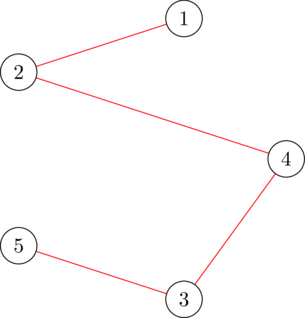
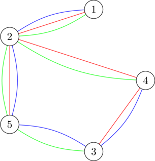

<h1 style='text-align: center;'> I. Growing Trees</h1>

<h5 style='text-align: center;'>time limit per test: 5 seconds</h5>
<h5 style='text-align: center;'>memory limit per test: 512 megabytes</h5>

[wowaka ft. Hatsune Miku - Ura-Omote Lovers](https://youtu.be/b_cuMcDWwsI)ඞYou are given an undirected connected simple graph with $n$ nodes and $m$ edges, where edge $i$ connects node $u_i$ and $v_i$, with two positive parameters $a_i$ and $b_i$ attached to it. Additionally, you are also given an integer $k$.

A non-negative array $x$ with size $m$ is called a $k$-spanning-tree generator if it satisfies the following: 

* Consider the undirected multigraph with $n$ nodes where edge $i$ is cloned $x_i$ times (i.e. there are $x_i$ edges connecting $u_i$ and $v_i$). It is possible to partition the edges of this graph into $k$ spanning trees, where each edge belongs to exactly one spanning tree$^\dagger$.

The cost of such array $x$ is defined as $\sum_{i = 1}^m a_i x_i^2 + b_i x_i$. Find the minimum cost of a $k$-spanning-tree generator.

$^\dagger$ A spanning tree of a (multi)graph is a subset of the graph's edges that form a tree connecting all vertices of the graph.

## Input

Each test contains multiple test cases. The first line contains an integer $t$ ($1 \le t \le 500$) — the number of test cases. The description of the test cases follows.

The first line of each test case contains three integers $n$, $m$, and $k$ ($2 \le n \le 50, n - 1 \le m \le \min(50, \frac{n(n - 1)}{2}), 1 \le k \le 10^7$) — the number of nodes in the graph, the number of edges in the graph, and the parameter for the $k$-spanning-tree generator.

Each of the next $m$ lines of each test case contains four integers $u_i$, $v_i$, $a_i$, and $b_i$ ($1 \le u_i, v_i \le n, u_i \neq v_i, 1 \le a_i, b_i \le 1000$) — the endpoints of the edge $i$ and its two parameters. It is guaranteed that the graph is simple and connected.

It is guaranteed that the sum of $n^2$ and the sum of $m^2$ over all test cases does not exceed $2500$.

## Output

For each test case, output a single integer: the minimum cost of a $k$-spanning-tree generator.

## Example

## Input


```

45 5 14 3 5 52 1 5 72 4 6 25 3 3 52 5 2 95 5 34 3 5 52 1 5 72 4 6 25 3 3 52 5 2 92 1 100000001 2 1000 100010 15 107 1 7 65 8 6 64 8 2 24 3 10 910 8 3 44 6 6 15 4 1 39 3 4 38 3 9 97 5 10 32 1 3 46 1 6 42 5 7 310 7 2 18 2 6 8
```
## Output


```

38
191
100000010000000000
2722

```
## Note

In the first test case, a valid $1$-spanning-tree generator is $x = [1, 1, 1, 1, 0]$, as indicated by the following figure. The cost of this generator is $(1^2 \cdot 5 + 1 \cdot 5) + (1^2 \cdot 5 + 1 \cdot 7) + (1^2 \cdot 6 + 1 \cdot 2) + (1^2 \cdot 3 + 1 \cdot 5) + (0^2 \cdot 4 + 0 \cdot 9) = 38$. It can be proven that no other generator has a lower cost.

  The $1$-spanning-tree partition of $x = [1, 1, 1, 1, 0]$ In the second test case, a valid $3$-spanning-tree generator is $x = [2, 3, 2, 2, 3]$, as indicated by the following figure. The cost of this generator is $(2^2 \cdot 5 + 2 \cdot 5) + (3^2 \cdot 5 + 3 \cdot 7) + (2^2 \cdot 6 + 2 \cdot 2) + (2^2 \cdot 3 + 2 \cdot 5) + (3^2 \cdot 4 + 3 \cdot 9) = 191$. It can be proven that no other generator has a lower cost.

  The $3$-spanning-tree partition of $x = [2, 3, 2, 2, 3]$ 

#### tags 

#3200 #binary_search #constructive_algorithms #flows #graphs #greedy 