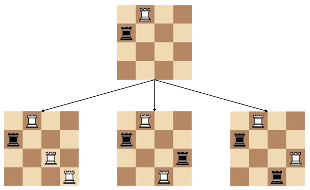

<h1 style='text-align: center;'> C. How Does the Rook Move?</h1>

<h5 style='text-align: center;'>time limit per test: 2 seconds</h5>
<h5 style='text-align: center;'>memory limit per test: 256 megabytes</h5>

You are given an $n \times n$ chessboard where you and the computer take turns alternatingly to place white rooks & black rooks on the board respectively. While placing rooks, you have to ensure that no two rooks attack each other. Two rooks attack each other if they share the same row or column regardless of color.

A valid move is placing a rook on a position ($r$, $c$) such that it doesn't attack any other rook.

You start first, and when you make a valid move in your turn, placing a white rook at position ($r$, $c$), the computer will mirror you and place a black rook at position ($c$, $r$) in its turn. If $r = c$, then the computer can't mirror your move, and skips its turn.

You have already played $k$ moves with the computer (the computer tries to mirror these moves too), and you must continue playing the game until there are no valid moves remaining. How many different final configurations are possible when you continue the game after the $k$ moves? It is guaranteed that the $k$ moves and the implied computer moves are valid. Since the answer may be large, print it modulo $10^9+7$.

Two configurations are considered different if there exists a coordinate ($r$, $c$) which has a rook in one configuration, but not in the other or the color of the rook on the coordinate is different.

## Input

The first line contains a single integer $t$ ($1 \leq t \leq 10^4$) — the number of test cases.

The first line of each test case contains two integers $n$ and $k$ ($1 \leq n \leq 3 \cdot 10^5$, $0 \leq k \leq n$) — the size of the chessboard and the number of moves you have already played respectively.

Each of the next $k$ lines of the test case contains two integers $r_i$ and $c_i$, denoting the $i$-th move you made.

It is guaranteed that the $k$ moves and the implied computer moves are valid.

It is guaranteed that the sum of $n$ over all test cases does not exceed $3 \cdot 10^5$.

## Output

For each test case, output a single integer on a new line — the total number of possible final configurations modulo $10^9+7$.

## Example

## Input


```

34 11 28 17 61000 44 4952 343222 33390 91
```
## Output


```

3
331
671968183

```
## Note

In the first test case, we have a $4 \times 4$ grid and you've already played $1$ move. After you and the computer play a turn, we have a white rook at ($1$, $2$), and a black rook at ($2$, $1$). There are three possible configurations from this state —

1. You place a white rook at ($3$, $4$) and the computer places a black rook at ($4$, $3$) as a response.
2. You place a white rook at ($4$, $3$) and the computer places a black rook at ($3$, $4$) as a response.
3. You place a white rook at ($3$, $3$) and then at ($4$, $4$), or the other way around. They both result in the same configuration.

  

#### tags 

#1600 #combinatorics #dp #math 