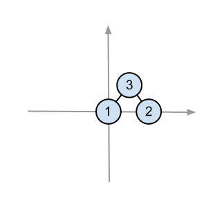
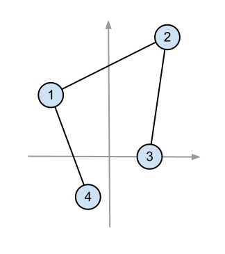

<h1 style='text-align: center;'> C. Paint Tree</h1>

<h5 style='text-align: center;'>time limit per test: 2 seconds</h5>
<h5 style='text-align: center;'>memory limit per test: 256 megabytes</h5>

You are given a tree with *n* vertexes and *n* points on a plane, no three points lie on one straight line.

Your task is to paint the given tree on a plane, using the given points as vertexes. 

That is, you should correspond each vertex of the tree to exactly one point and each point should correspond to a vertex. If two vertexes of the tree are connected by an edge, then the corresponding points should have a segment painted between them. The segments that correspond to non-adjacent edges, should not have common points. The segments that correspond to adjacent edges should have exactly one common point.

## Input

The first line contains an integer *n* (1 ≤ *n* ≤ 1500) — the number of vertexes on a tree (as well as the number of chosen points on the plane).

Each of the next *n* - 1 lines contains two space-separated integers *u**i* and *v**i* (1 ≤ *u**i*, *v**i* ≤ *n*, *u**i* ≠ *v**i*) — the numbers of tree vertexes connected by the *i*-th edge.

Each of the next *n* lines contain two space-separated integers *x**i* and *y**i* ( - 109 ≤ *x**i*, *y**i* ≤ 109) — the coordinates of the *i*-th point on the plane. No three points lie on one straight line.

It is guaranteed that under given constraints problem has a solution.

## Output

Print *n* distinct space-separated integers from 1 to *n*: the *i*-th number must equal the number of the vertex to place at the *i*-th point (the points are numbered in the order, in which they are listed in the input).

If there are several solutions, print any of them.

## Examples

## Input


```
3  
1 3  
2 3  
0 0  
1 1  
2 0  

```
## Output


```
1 3 2  

```
## Input


```
4  
1 2  
2 3  
1 4  
-1 -2  
3 5  
-3 3  
2 0  

```
## Output


```
4 2 1 3  

```
## Note

The possible solutions for the sample are given below.

   

#### tags 

#2200 #constructive_algorithms #divide_and_conquer #geometry #sortings #trees 